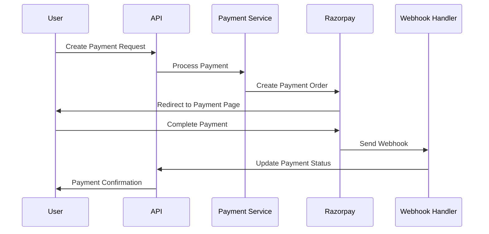

# CodeGeeky - Open Source LMS Platform

<!-- <p align="center">
  
</p> -->

<h3 align="center">
<b>
🎓 Modern Learning Management System for Developers 🎓
</b>
</h3>

<p align="center">
Build feature-rich learning platforms with internship management, payment processing, and advanced analytics. CodeGeeky handles enrollment workflows, payment integration, and content management so you can focus on building, not infrastructure.
</p>

<h5 align="center">

[Documentation](https://docs.codegeeky.io) • [Demo](https://demo.codegeeky.io) • [Website](https://codegeeky.io/) • [LinkedIn](https://www.linkedin.com/company/codegeeky)

[](https://pkg.go.dev/github.com/omkar273/codegeeky) [](https://www.postgresql.org/) [](https://www.docker.com/)

</h5>

---

## Open Architecture

The CodeGeeky core (enrollment, payments, content management, analytics) has an open and composable design.

<!-- <p align="center">
  
</p> -->

Your application, whether it's running educational platforms, corporate training systems, or custom learning workflows, can integrate with CodeGeeky. You can directly stream data from existing LMS systems, analytics pipelines, or build custom integrations.

At the core, CodeGeeky processes this data in real time. We handle everything that usually ends up as custom logic built by developers. Our platform manages enrollment workflows, processes payments through multiple gateways, applies discounts and promotions, enforces access controls, and generates comprehensive analytics automatically. Whether you're using subscription-based learning, pay-per-course models, or enterprise training programs, you can set up and iterate on your learning platform without writing LMS infrastructure from scratch.

After enrollment and payment processing, our platform connects to your existing tools for payments, CRM, analytics, and content management, ensuring learning data flows into the systems your business already uses. It can sync enrollment data to your CRM, update payment information in your payment processor, and push learning analytics to your business intelligence tools.

With this architecture, you get full control over how your learning platform works, while saving your team from the complexity of maintaining it all.

## Why LMS development is a developer problem?

##### TL;DR

_When existing LMS tools don't flex to your product's needs, developers shoulder the burden eating up valuable development time and causing ongoing maintenance headaches._

<p align="center">
  
</p>

Modern learning platform developers often find themselves wrestling with LMS systems. Here are some of the biggest pain points that turn LMS development into a "developer problem":

- **Rigid LMS platforms (lack of flexibility):** Traditional LMS services handle basic course management or simple enrollments, but anything beyond that – internship programs, payment processing, advanced analytics, custom enrollment workflows, feature gating, custom reporting logic – usually isn't supported out of the box. Developers end up writing countless workarounds or custom code to accommodate these needs. In other words, if your learning model doesn't fit the tool, you're stuck bending your product or building logic from scratch.

- **Complex enrollment and payment integration at scale:** Implementing accurate enrollment tracking with payment processing is hard. It involves capturing high-volume enrollment events, processing payments through multiple gateways, handling edge cases (refunds, partial enrollments, time zones, etc.), and ensuring it all works reliably at scale. Few teams anticipate how many moving parts this requires until they're deep in the weeds of building it.

- **Vendor lock-in and black boxes:** Relying on third-party LMS platforms can mean surrendering flexibility. Many SaaS LMS providers are closed systems or charge a percentage fee on revenue, which frustrates engineers who want full control over their learning logic and data. Changing providers later can be a massive undertaking, so teams feel "stuck" with a less-than-ideal solution.

- **Delayed monetization & opportunity cost:** Every week spent building or patching an LMS system is a week not spent on core product features. If it takes months to implement a new learning model or payment integration, that's delayed revenue and lost agility for the business. What might be scoped as a "quick two-month project" can quickly spiral into a multi-year maintenance headache, tying up engineering resources and slowing time-to-market for new offerings.

## How CodeGeeky solves this

CodeGeeky's approach is to abstract away the hard parts of LMS development while preserving maximum flexibility and transparency for developers. It addresses the above pain points in several key ways:

- **Developer-first design:** CodeGeeky is built API-first with easy integrations. You can instrument your learning platform by simply sending enrollment events via SDKs, and CodeGeeky handles the enrollment processing, payment integration, and analytics logic in real time. This means minimal code to write on your end and no need to reinvent enrollment workflows or payment processing.

- **Open-source and self-hostable:** CodeGeeky is open-source, so you can run it on your own infrastructure for full transparency and control. There's no black-box dependency or surprise fees and you're free from vendor lock-in. You can inspect the code, extend functionality, and trust that your learning logic is fully in your hands.

- **Composable with your stack:** Rather than replacing your existing LMS or payment provider, CodeGeeky augments it. You can build it from scratch or build on top of your existing LMS providers like Moodle or Canvas to manage enrollment data, payment rules, discounts, and entitlements. You can easily integrate with your existing payment gateways, CRM, analytics tools, etc. This layered approach preserves your current workflows and customer touchpoints.

- **Flexible learning models out-of-the-box:** Whether you need pure internship-based learning, tiered course plans, subscription-based access, prepaid credits, free tiers with premium upgrades, or any hybrid model, CodeGeeky's data model and rules engine can support it. CodeGeeky is designed to accommodate changing learning strategies in minutes that would normally require schema updates and migration scripts.

- **Transparency and visibility:** Because CodeGeeky tracks every enrollment and ties it to payments, you (and your customers) get clear visibility into learning progress and charges. It can provide real-time enrollment summaries and learning analytics, helping both engineering and business teams ensure everything lines up correctly. Students get detailed progress reports that show exactly what they're learning, reducing confusion and improving engagement.

By handling the heavy lifting from real-time enrollment tracking to payment processing, CodeGeeky lets your team focus on building your actual learning content, not the LMS system around it.

## **Features**

CodeGeeky provides a rich set of features to power modern learning platforms. Key features include:

<p align="center">
  
</p>

- **[**Internship Management:\*\*](https://docs.codegeeky.io/api-reference/internships) Create and manage comprehensive internship programs with detailed tracking, batch management, and progress monitoring. CodeGeeky's internship system can handle complex workflows and provides real-time analytics, ensuring your internship programs are always up-to-date with actual student progress.

- **[**Enrollment & Payment Processing:\*\*](https://docs.codegeeky.io/docs/Enrollment/Overview) Support flexible enrollment workflows with full payment integration. You can process enrollments with multiple payment gateways, apply discounts and promotional codes, and handle complex billing scenarios. CodeGeeky's enrollment system is built-in, so you don't need extra custom logic to handle enrollment workflows or payment processing.

- **[**Content Management:\*\*](https://docs.codegeeky.io/docs/Content/Overview) Design and iterate on learning content with total flexibility – whether video courses, interactive assignments, downloadable resources, or hybrid content types. You can launch new content or modify existing content without additional engineering effort. CodeGeeky lets you manage content versions and track usage over time, making it easy to evolve your learning content as your product and market strategy change.

- **[**Advanced Analytics:\*\*](https://docs.codegeeky.io/docs/Analytics/Overview) Manage learning analytics and business intelligence with comprehensive reporting. CodeGeeky lets you track student progress, enrollment metrics, revenue analytics, and custom KPIs tied to your learning goals. You can enforce learning limits and generate detailed reports without building complex analytics logic yourself. This ensures that your learning platform's analytics are always in sync with what your business needs.

- **[**Multi-Gateway Payments:\*\*](https://docs.codegeeky.io/docs/Payments/Overview) CodeGeeky generates clear, accurate payment processing through multiple gateways based on real-time enrollment data and payment preferences. It automates payment cycles – handling refunds, partial payments, and payment failures – and produces detailed payment reports that give you full visibility into your revenue. Finance teams can easily reconcile payments because every transaction is linked to tracked enrollments or defined pricing. You can also integrate this with your payment processor to automate charging customers once an enrollment is confirmed.

Each of these features is accessible via CodeGeeky's APIs and dashboard, allowing you to mix and match to build the exact learning platform experience you need.

## 🚀 Quick Start

### **Prerequisites**

- **Go 1.24+** (latest stable)
- **PostgreSQL 14+** with PostGIS extension
- **Redis** (for caching and sessions)
- **Docker & Docker Compose** (optional)

### **Environment Setup**

1. **Clone the Repository**

```bash
git clone https://github.com/omkar273/codegeeky.git
cd codegeeky
```

2. **Install Dependencies**

```bash
go mod download
```

3. **Configure Environment**

Copy the configuration template:

```bash
cp internal/config/config.yaml config.yaml
```

Update `config.yaml` with your settings:

```yaml
# Server Configuration
server:
  env: "development"
  address: ":8080"

# Database Configuration
postgres:
  host: "localhost"
  port: 5432
  user: "codegeeky_user"
  password: "your_password"
  dbname: "codegeeky_db"
  sslmode: "disable"
  auto_migrate: true

# Authentication (Supabase)
supabase:
  url: "https://your-project.supabase.co"
  key: "your_anon_key"
  jwt_secret: "your_jwt_secret"
  service_key: "your_service_key"

# Payment Gateway (Razorpay)
razorpay:
  api_key: "rzp_test_your_key"
  api_secret: "your_secret"

# File Storage (Cloudinary)
cloudinary:
  api_key: "your_api_key"
  api_secret: "your_api_secret"
  cloud_name: "your_cloud_name"
```

4. **Database Setup**

```bash
# Create database
createdb codegeeky_db

# Run migrations
go run cmd/migrate/main.go
```

5. **Start the Application**

```bash
# Development mode
go run cmd/server/main.go

# Or with hot reload
air
```

The server will start at `http://localhost:8080`

## 🔐 Authentication & Authorization

### **Multi-Layer Security System**

The system implements a **comprehensive authorization framework** combining:

#### **1. RBAC (Role-Based Access Control)**

- **Fast O(1) permission checks**
- **Predefined roles**: Admin, Instructor, Student
- **Static permission mappings**

#### **2. ABAC (Attribute-Based Access Control)**

- **Context-aware policies**
- **Dynamic access control**
- **Enrollment-based restrictions**

### **Usage Example**

```go
// Check authorization
allowed, err := authService.IsAuthorized(ctx, &auth.AccessRequest{
    Subject: &auth.AuthContext{
        UserID: "user_123",
        Role:   types.UserRoleStudent,
    },
    Resource: &auth.Resource{
        Type: "internship",
        ID:   "internship_456",
    },
    Action: auth.PermissionViewInternship,
})
```

## 💳 Payment System

### **Multi-Gateway Support**

- **Razorpay** (Primary - India-focused)
- **Stripe** (International)
- **Extensible architecture** for additional gateways

### **Payment Flow**



### **Webhook Processing**

```go
// Webhook handler for payment events
func (h *WebhookHandler) ProcessPaymentWebhook(ctx context.Context, payload []byte) error {
    // Verify webhook signature
    // Process payment status
    // Update enrollment status
    // Send notifications
    return nil
}
```

## 📚 Core Features

### **1. Internship Management**

- **CRUD Operations**: Create, read, update, delete internships
- **Batch Management**: Organize internships into batches
- **Category System**: Categorize internships by domain
- **Content Management**: Upload and manage course materials

### **2. Enrollment System**

- **Application Workflow**: Apply for internships
- **Payment Integration**: Seamless payment processing
- **Status Tracking**: Monitor application progress
- **Peer Applications**: View other applicants

### **3. User Management**

- **Role-Based Access**: Admin, Instructor, Student roles
- **Profile Management**: User profiles and preferences
- **Onboarding**: User registration and setup
- **Authentication**: JWT-based authentication

### **4. Discount System**

- **Coupon Management**: Create and manage discount codes
- **Validation Rules**: Usage limits, expiration dates
- **Multiple Types**: Percentage, fixed amount, BOGO
- **Auto-Application**: Best discount selection

## 🔧 Development Guide

### **Adding New Features**

#### **Step 1: Domain Layer**

```go
// internal/domain/feature/model.go
type Feature struct {
    ID        string    `json:"id"`
    Name      string    `json:"name"`
    CreatedAt time.Time `json:"created_at"`
    UpdatedAt time.Time `json:"updated_at"`
}

// internal/domain/feature/repository.go
type Repository interface {
    Create(ctx context.Context, feature *Feature) error
    GetByID(ctx context.Context, id string) (*Feature, error)
    List(ctx context.Context, filter interface{}) ([]*Feature, error)
    Update(ctx context.Context, id string, feature *Feature) error
    Delete(ctx context.Context, id string) error
}
```

#### **Step 2: Repository Implementation**

```go
// internal/repository/ent/feature.go
type featureRepository struct {
    client *ent.Client
}

func NewFeatureRepository(client *ent.Client) domain.Repository {
    return &featureRepository{client: client}
}

// Implement interface methods
```

#### **Step 3: Service Layer**

```go
// internal/service/feature.go
type FeatureService interface {
    CreateFeature(ctx context.Context, req *CreateFeatureRequest) (*Feature, error)
    GetFeature(ctx context.Context, id string) (*Feature, error)
    ListFeatures(ctx context.Context, filter interface{}) ([]*Feature, error)
    UpdateFeature(ctx context.Context, id string, req *UpdateFeatureRequest) (*Feature, error)
    DeleteFeature(ctx context.Context, id string) error
}

type featureService struct {
    repo domain.Repository
    logger *logger.Logger
}
```

#### **Step 4: API Handler**

```go
// internal/api/v1/feature.go
type FeatureHandler struct {
    service service.FeatureService
    logger  *logger.Logger
}

func (h *FeatureHandler) CreateFeature(c *gin.Context) {
    // Handle HTTP request
    // Validate input
    // Call service
    // Return response
}
```

#### **Step 5: Update Router**

```go
// internal/api/router.go
func (r *Router) setupFeatureRoutes() {
    features := r.v1.Group("/features")
    features.Use(middleware.AuthRequired())
    {
        features.POST("/", r.handlers.CreateFeature)
        features.GET("/:id", r.handlers.GetFeature)
        features.PUT("/:id", r.handlers.UpdateFeature)
        features.DELETE("/:id", r.handlers.DeleteFeature)
    }
}
```

### **Testing Strategy**

#### **Unit Tests**

```go
func TestFeatureService_CreateFeature(t *testing.T) {
    // Arrange
    mockRepo := &MockFeatureRepository{}
    service := NewFeatureService(mockRepo, logger)

    // Act
    result, err := service.CreateFeature(ctx, request)

    // Assert
    assert.NoError(t, err)
    assert.NotNil(t, result)
}
```

#### **Integration Tests**

```go
func TestFeatureAPI_CreateFeature(t *testing.T) {
    // Setup test server
    // Make HTTP request
    // Assert response
}
```

## 📊 API Documentation

### **Swagger Documentation**

Access the interactive API documentation at:

- **Development**: `http://localhost:8080/swagger/index.html`
- **Production**: `https://api.codegeeky.com/swagger/index.html`

### **Key Endpoints**

#### **Authentication**

```
POST   /v1/auth/login          # User login
POST   /v1/auth/register       # User registration
POST   /v1/auth/refresh        # Refresh JWT token
```

#### **Internships**

```
GET    /v1/internships         # List internships
POST   /v1/internships         # Create internship
GET    /v1/internships/:id     # Get internship details
PUT    /v1/internships/:id     # Update internship
DELETE /v1/internships/:id     # Delete internship
```

#### **Enrollments**

```
POST   /v1/internships/:id/apply    # Apply for internship
GET    /v1/enrollments              # List user enrollments
GET    /v1/enrollments/:id          # Get enrollment details
PUT    /v1/enrollments/:id/status   # Update enrollment status
```

#### **Payments**

```
POST   /v1/payments/create          # Create payment
POST   /v1/payments/webhooks/:gateway # Payment webhooks
GET    /v1/payments/:id/status      # Check payment status
```

## 🚀 Deployment

### **Docker Deployment**

```bash
# Build image
docker build -t codegeeky-backend .

# Run container
docker run -p 8080:8080 \
  -e POSTGRES_HOST=your-db-host \
  -e POSTGRES_PASSWORD=your-password \
  codegeeky-backend
```

### **Docker Compose**

```yaml
version: "3.8"
services:
  app:
    build: .
    ports:
      - "8080:8080"
    environment:
      - POSTGRES_HOST=postgres
    depends_on:
      - postgres
      - redis

  postgres:
    image: postgres:14
    environment:
      POSTGRES_DB: codegeeky_db
      POSTGRES_USER: codegeeky_user
      POSTGRES_PASSWORD: your_password
    volumes:
      - postgres_data:/var/lib/postgresql/data

  redis:
    image: redis:7-alpine
    ports:
      - "6379:6379"

volumes:
  postgres_data:
```

### **Production Checklist**

- [ ] **Environment Variables**: Configure all production settings
- [ ] **Database**: Set up PostgreSQL with proper indexes
- [ ] **Redis**: Configure Redis for caching and sessions
- [ ] **SSL/TLS**: Enable HTTPS with valid certificates
- [ ] **Monitoring**: Set up logging and monitoring
- [ ] **Backup**: Configure database backups
- [ ] **Security**: Review security settings
- [ ] **Performance**: Optimize for production load

## 📈 Monitoring & Observability

### **Health Checks**

```
GET /health          # Basic health check
GET /health/detailed # Detailed system status
```

### **Metrics**

- **Request Rate**: Requests per second
- **Response Time**: Average response time
- **Error Rate**: Error percentage
- **Payment Success Rate**: Payment processing success
- **Enrollment Conversion**: Application to enrollment rate

### **Logging**

Structured logging with correlation IDs:

```go
logger.Infow("Payment processed successfully",
    "payment_id", paymentID,
    "user_id", userID,
    "amount", amount,
    "gateway", "razorpay",
)
```

## 👨🏻‍💻 Let's Build Together! 👩🏻‍💻

Whether you're a newbie coder or a wizard 🧙‍♀️, your perspective is golden. Take a peek at our:

📜 [Contribution Guidelines](CONTRIBUTING.md)

🏗️ [Local Development Setup](SETUP.md)

❤️ [Code of Conduct](CODE_OF_CONDUCT.md)

## Contributors

<a href="https://github.com/Caygnus/codegeeky-lms-backend/graphs/contributors">
  
</a>

## Repo Activity


## 🤝 Contributing

### **Development Workflow**

1. **Fork the repository**
2. **Create feature branch**: `git checkout -b feature/amazing-feature`
3. **Make changes** following the development guide
4. **Write tests** for new functionality
5. **Update documentation** as needed
6. **Submit pull request** with clear description

### **Code Standards**

- **Go Format**: Use `gofmt` for code formatting
- **Linting**: Run `golangci-lint` for code quality
- **Testing**: Maintain >80% test coverage
- **Documentation**: Add godoc comments for exported functions

### **Commit Convention**

```
feat: add new payment gateway support
fix: resolve webhook signature validation issue
docs: update API documentation
test: add integration tests for enrollment flow
refactor: improve error handling in auth service
```

## 📄 License

CodeGeeky is a commercial open source company, which means some parts of this open source repository require a commercial license. The concept is called "Open Core" where the core technology (99%) is fully open source, licensed under [AGPLv3](https://opensource.org/license/agpl-v3) and the last 1% is covered under a commercial license (["/ee" Enterprise Edition"]).

> [!TIP]
> We work closely with the community and always invite feedback about what should be open and what is fine to be commercial. This list is not set and stone and we have moved things from commercial to open in the past. Please open a [discussion](https://github.com/omkar273/codegeeky/discussions) if you feel like something is wrong.

## 🆘 Support

- **Documentation**: [docs/](docs/) directory
- **Issues**: [GitHub Issues](https://github.com/omkar273/codegeeky/issues)
- **Discussions**: [GitHub Discussions](https://github.com/omkar273/codegeeky/discussions)

---

## 🎯 Key Benefits

✅ **Scalable Architecture** - Clean architecture with dependency injection  
✅ **Advanced Security** - RBAC + ABAC authorization system  
✅ **Payment Integration** - Multi-gateway payment processing  
✅ **Event-Driven** - Real-time webhook and notification system  
✅ **Comprehensive Testing** - Unit, integration, and e2e tests  
✅ **Production Ready** - Monitoring, logging, and deployment guides

This LMS platform provides a **robust foundation** for building **modern learning platforms** with **enterprise-grade features** and **scalable architecture**.
