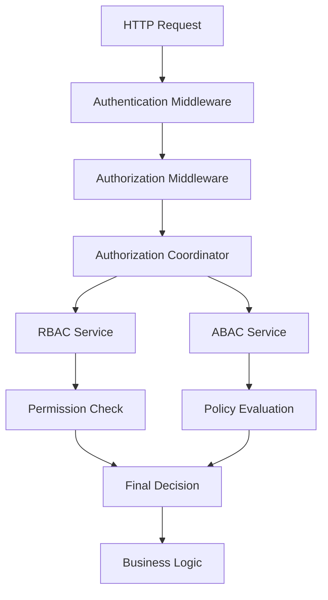

# 🔐 Authorization Guide: Best Practices & Implementation

This guide provides comprehensive documentation on implementing secure access control in your Go backend system using Role-Based Access Control (RBAC) and Attribute-Based Access Control (ABAC).

## 📋 Table of Contents

1. [System Overview](#system-overview)
2. [Authorization Architecture](#authorization-architecture)
3. [Best Practices](#best-practices)
4. [Implementation Patterns](#implementation-patterns)
5. [Adding New Rules & Policies](#adding-new-rules--policies)
6. [Testing Authorization](#testing-authorization)
7. [Performance Optimization](#performance-optimization)
8. [Security Guidex2lines](#security-guidelines)
9. [Troubleshooting](#troubleshooting)

## 🏗️ System Overview

Your authorization system implements a **multi-layered security approach** combining:

- **RBAC (Role-Based Access Control)**: Fast, simple role-to-permission mapping
- **ABAC (Attribute-Based Access Control)**: Fine-grained, context-aware authorization
- **Caching Layer**: Performance optimization for authorization decisions
- **Audit Trail**: Complete logging of all authorization decisions

### Key Components



## 🏛️ Authorization Architecture

### Layer 1: Route-Level Protection (Middleware)

**Purpose**: Coarse-grained access control at the HTTP route level

```go
// Basic role-based protection
router.POST("/internships",
    middleware.AuthenticateMiddleware(),
    middleware.AuthorizationMiddleware(),
    middleware.RequireInstructorOrAdmin(),
    handler.CreateInternship,
)

// Permission-based protection
router.GET("/internships/:id",
    middleware.AuthenticateMiddleware(),
    middleware.AuthorizationMiddleware(),
    middleware.RequirePermission(auth.PermissionViewInternship, "internship"),
    handler.GetInternship,
)
```

### Layer 2: Service-Level Authorization (Business Logic)

**Purpose**: Context-aware, fine-grained authorization with business rules

```go
func (s *internshipService) Update(ctx context.Context, id string, req *dto.UpdateInternshipRequest) error {
    // Get auth context from middleware
    authCtx := auth.GetAuthContextFromContext(ctx)

    // Get existing resource for context
    existing, err := s.internshipRepo.Get(ctx, id)
    if err != nil {
        return err
    }

    // Create detailed authorization request
    authRequest := &auth.AccessRequest{
        Subject: authCtx,
        Resource: &auth.Resource{
            Type: "internship",
            ID:   id,
            Attributes: map[string]interface{}{
                "created_by": existing.CreatedBy,  // Ownership check
                "status":     existing.Status,     // Status-based rules
                "department": existing.Department, // Department restrictions
            },
        },
        Action: auth.PermissionUpdateInternship,
    }

    // Check authorization
    allowed, err := s.authzService.IsAuthorized(ctx, authRequest)
    if err != nil {
        return fmt.Errorf("authorization check failed: %w", err)
    }
    if !allowed {
        return ierr.ErrPermissionDenied
    }

    // Proceed with business logic
    return s.internshipRepo.Update(ctx, id, req)
}
```

### Layer 3: Data-Level Security (Repository)

**Purpose**: Row-level security and data filtering

```go
func (r *internshipRepository) List(ctx context.Context, filter *types.InternshipFilter) ([]*domain.Internship, error) {
    authCtx := auth.GetAuthContextFromContext(ctx)

    // Apply role-based filtering at database level
    switch authCtx.Role {
    case types.UserRoleStudent:
        filter.Status = []string{"published"}
        filter.EnrolledUserID = authCtx.UserID
    case types.UserRoleInstructor:
        filter.CreatedByOrPublished = authCtx.UserID
    case types.UserRoleAdmin:
        // No additional filtering for admins
    }

    return r.db.Find(filter)
}
```

## ✅ Best Practices

### 1. Defense in Depth

**❌ Wrong: Single Point of Authorization**

```go
// Only checking at middleware level
router.POST("/internships", middleware.RequireInstructor(), handler.CreateInternship)

func (h *handler) CreateInternship(c *gin.Context) {
    // No additional authorization checks
    s.internshipService.Create(ctx, req) // Dangerous!
}
```

**✅ Correct: Multi-Layer Authorization**

```go
// Layer 1: Route protection
router.POST("/internships",
    middleware.AuthenticateMiddleware(),
    middleware.RequireInstructorOrAdmin(),
    handler.CreateInternship,
)

// Layer 2: Service-level authorization
func (s *internshipService) Create(ctx context.Context, req *dto.CreateInternshipRequest) error {
    authCtx := auth.GetAuthContextFromContext(ctx)

    // Always verify authorization in service layer
    allowed, err := s.authzService.IsAuthorized(ctx, &auth.AccessRequest{
        Subject:  authCtx,
        Resource: &auth.Resource{Type: "internship"},
        Action:   auth.PermissionCreateInternship,
    })

    if !allowed {
        return ierr.ErrPermissionDenied
    }

    // Business logic...
}
```

### 2. Principle of Least Privilege

**Always start with the minimum required permissions:**

```go
// Role hierarchy (from least to most privileged)
types.UserRoleStudent    // Read-only access to enrolled content
types.UserRoleInstructor // Manage own content + read others
types.UserRoleAdmin      // Full system access
```

### 3. Explicit Deny by Default

```go
func (s *rbacService) HasPermission(role types.UserRole, permission auth.Permission) bool {
    permissions, exists := s.rolePermissions[role]
    if !exists {
        return false // Explicit deny if role doesn't exist
    }

    for _, p := range permissions {
        if p == permission {
            return true // Explicit allow
        }
    }

    return false // Explicit deny if permission not found
}
```

### 4. Context-Aware Authorization

**Include relevant context in authorization decisions:**

```go
// Good: Include business context
authRequest := &auth.AccessRequest{
    Subject: authCtx,
    Resource: &auth.Resource{
        Type: "content",
        ID:   contentID,
        Attributes: map[string]interface{}{
            "internship_id":     internshipID,
            "required_progress": 0.75,           // 75% completion required
            "access_window":     accessWindow,   // Time-based access
            "content_level":     "advanced",     // Difficulty level
        },
    },
    Action: auth.PermissionViewLectures,
}
```

## 🔧 Implementation Patterns

### Pattern 1: Simple Role-Based Access

**Use Case**: Basic operations that only depend on user role

```go
// Route level
router.GET("/admin/users", middleware.RequireAdmin(), handler.ListUsers)

// Service level
func (s *userService) GetAll(ctx context.Context) ([]*domain.User, error) {
    authCtx := auth.GetAuthContextFromContext(ctx)

    // Simple role check
    if authCtx.Role != types.UserRoleAdmin {
        return nil, ierr.ErrPermissionDenied
    }

    return s.userRepo.GetAll(ctx)
}
```

### Pattern 2: Ownership-Based Access

**Use Case**: Users can only modify resources they own

```go
func (s *internshipService) Update(ctx context.Context, id string, req *dto.UpdateRequest) error {
    authCtx := auth.GetAuthContextFromContext(ctx)
    existing, _ := s.internshipRepo.Get(ctx, id)

    // Check ownership or admin role
    if existing.CreatedBy != authCtx.UserID && authCtx.Role != types.UserRoleAdmin {
        return ierr.ErrPermissionDenied
    }

    return s.internshipRepo.Update(ctx, id, req)
}
```

### Pattern 3: Enrollment-Based Access

**Use Case**: Students can only access content they're enrolled in

```go
func (s *contentService) GetContent(ctx context.Context, contentID, internshipID string) (*domain.Content, error) {
    authCtx := auth.GetAuthContextFromContext(ctx)

    // For students, check enrollment
    if authCtx.Role == types.UserRoleStudent {
        enrolled, err := s.enrollmentService.IsUserEnrolled(ctx, authCtx.UserID, internshipID)
        if err != nil || !enrolled {
            return nil, ierr.ErrPermissionDenied
        }
    }

    return s.contentRepo.Get(ctx, contentID)
}
```

### Pattern 4: Progress-Based Access

**Use Case**: Content unlocked based on completion progress

```go
func (s *contentService) AccessAdvancedContent(ctx context.Context, contentID string) error {
    authCtx := auth.GetAuthContextFromContext(ctx)

    // Check user progress
    progress, err := s.progressService.GetUserProgress(ctx, authCtx.UserID)
    if err != nil {
        return err
    }

    if progress.CompletionPercentage < 0.75 { // 75% required
        return ierr.NewErrorf("insufficient progress: %d%% completed, 75%% required",
            int(progress.CompletionPercentage*100))
    }

    return nil
}
```

## 🆕 Adding New Rules & Policies

### Adding a New Permission

**Step 1: Define the Permission**

```go
// internal/domain/auth/model.go
const (
    // Existing permissions...
    PermissionCreateInternship Permission = "internship:create"
    PermissionViewInternship   Permission = "internship:view"

    // Add new permission
    PermissionExportData Permission = "data:export"
)
```

**Step 2: Update Role-Permission Mapping**

```go
// internal/auth/rbac/service.go
func initializeRolePermissions() map[types.UserRole][]auth.Permission {
    return map[types.UserRole][]auth.Permission{
        types.UserRoleAdmin: {
            // Existing permissions...
            auth.PermissionCreateInternship,
            auth.PermissionViewInternship,

            // Add new permission to appropriate roles
            auth.PermissionExportData,
        },
        types.UserRoleInstructor: {
            auth.PermissionCreateInternship,
            auth.PermissionViewInternship,
            // Instructors can export their own data
            auth.PermissionExportData,
        },
        types.UserRoleStudent: {
            auth.PermissionViewInternship,
            // Students cannot export data
        },
    }
}
```

**Step 3: Use in Middleware**

```go
// Add route protection
router.GET("/export/data",
    middleware.RequirePermission(auth.PermissionExportData, "data"),
    handler.ExportData,
)
```

**Step 4: Use in Service Layer**

```go
func (s *dataService) Export(ctx context.Context, filters *ExportFilters) (*ExportResult, error) {
    authCtx := auth.GetAuthContextFromContext(ctx)

    // Check permission
    allowed, err := s.authzService.IsAuthorized(ctx, &auth.AccessRequest{
        Subject:  authCtx,
        Resource: &auth.Resource{Type: "data"},
        Action:   auth.PermissionExportData,
    })

    if !allowed {
        return nil, ierr.ErrPermissionDenied
    }

    // Apply role-based filtering
    if authCtx.Role == types.UserRoleInstructor {
        filters.CreatedBy = authCtx.UserID // Only own data
    }

    return s.dataRepo.Export(ctx, filters)
}
```

### Adding a New ABAC Policy

**Step 1: Create the Policy**

```go
// internal/auth/abac/policies/department_policy.go
package policies

type DepartmentAccessPolicy struct{}

func (p *DepartmentAccessPolicy) GetName() string {
    return "DepartmentAccess"
}

func (p *DepartmentAccessPolicy) GetPriority() int {
    return 150 // Medium priority
}

func (p *DepartmentAccessPolicy) Applies(request *auth.AccessRequest) bool {
    // Apply to content access in specific departments
    return request.Resource.Type == "content" &&
           request.Resource.Attributes["department"] != nil
}

func (p *DepartmentAccessPolicy) Evaluate(ctx context.Context, request *auth.AccessRequest) (Decision, error) {
    // Get user's department
    userDept, exists := request.Subject.Attributes["department"]
    if !exists {
        return Decision{
            Allow:  false,
            Reason: "User department not specified",
        }, nil
    }

    // Get resource department
    resourceDept := request.Resource.Attributes["department"]

    // Allow access if departments match OR user is admin
    if userDept == resourceDept || request.Subject.Role == types.UserRoleAdmin {
        return Decision{
            Allow:  true,
            Reason: "Department access granted",
        }, nil
    }

    return Decision{
        Allow:  false,
        Reason: "Cross-department access denied",
    }, nil
}
```

**Step 2: Register the Policy**

```go
// internal/auth/abac/service.go
func (s *service) registerDefaultPolicies() {
    // Existing policies...
    s.RegisterPolicy(NewEnrollmentBasedAccessPolicy())
    s.RegisterPolicy(NewOwnershipPolicy())

    // Add new policy
    s.RegisterPolicy(NewDepartmentAccessPolicy())
}
```

**Step 3: Use in Service Layer**

```go
func (s *contentService) GetByDepartment(ctx context.Context, contentID string) (*domain.Content, error) {
    authCtx := auth.GetAuthContextFromContext(ctx)

    // Get content to check department
    content, err := s.contentRepo.Get(ctx, contentID)
    if err != nil {
        return nil, err
    }

    // Create authorization request with department context
    authRequest := &auth.AccessRequest{
        Subject: authCtx,
        Resource: &auth.Resource{
            Type: "content",
            ID:   contentID,
            Attributes: map[string]interface{}{
                "department": content.Department,
            },
        },
        Action: auth.PermissionViewContent,
    }

    allowed, err := s.authzService.IsAuthorized(ctx, authRequest)
    if !allowed {
        return nil, ierr.ErrPermissionDenied
    }

    return content, nil
}
```

### Adding a New Role

**Step 1: Define the Role**

```go
// internal/types/user.go
type UserRole string

const (
    UserRoleStudent    UserRole = "STUDENT"
    UserRoleInstructor UserRole = "INSTRUCTOR"
    UserRoleAdmin      UserRole = "ADMIN"

    // Add new role
    UserRoleModerator UserRole = "MODERATOR"
)
```

**Step 2: Update Role Permissions**

```go
// internal/auth/rbac/service.go
func initializeRolePermissions() map[types.UserRole][]auth.Permission {
    return map[types.UserRole][]auth.Permission{
        // Existing roles...

        types.UserRoleModerator: {
            // Moderator permissions (between instructor and admin)
            auth.PermissionViewInternship,
            auth.PermissionViewLectures,
            auth.PermissionViewAssignments,
            auth.PermissionViewResources,
            auth.PermissionViewAnalytics,
            auth.PermissionManageUsers, // Can manage users but not system config
        },
    }
}
```

**Step 3: Update Middleware**

```go
// Add convenience middleware for new role
func RequireModeratorOrAdmin() gin.HandlerFunc {
    return RequireRole(types.UserRoleModerator, types.UserRoleAdmin)
}
```

**Step 4: Update Role Hierarchy**

```go
// internal/auth/rbac/service.go
func GetRoleHierarchy() map[types.UserRole]int {
    return map[types.UserRole]int{
        types.UserRoleAdmin:      4, // Highest level
        types.UserRoleModerator:  3, // New level
        types.UserRoleInstructor: 2, // Middle level
        types.UserRoleStudent:    1, // Basic level
    }
}
```

## 🧪 Testing Authorization

### Unit Testing RBAC

```go
func TestRBACPermissions(t *testing.T) {
    authzService := auth.NewAuthorizationService(logger)

    tests := []struct {
        role       types.UserRole
        permission auth.Permission
        expected   bool
    }{
        {types.UserRoleAdmin, auth.PermissionCreateInternship, true},
        {types.UserRoleInstructor, auth.PermissionCreateInternship, true},
        {types.UserRoleStudent, auth.PermissionCreateInternship, false},
        {types.UserRoleStudent, auth.PermissionViewInternship, true},
    }

    for _, test := range tests {
        t.Run(fmt.Sprintf("%s_%s", test.role, test.permission), func(t *testing.T) {
            result := authzService.CheckRolePermission(test.role, test.permission)
            assert.Equal(t, test.expected, result)
        })
    }
}
```

### Integration Testing ABAC

```go
func TestEnrollmentBasedAccess(t *testing.T) {
    ctx := context.Background()
    authzService := setupAuthzService(t)

    t.Run("enrolled student can access content", func(t *testing.T) {
        authRequest := &auth.AccessRequest{
            Subject: &auth.AuthContext{
                UserID: "student-123",
                Role:   types.UserRoleStudent,
                Attributes: map[string]interface{}{
                    "enrolled_internships": []string{"internship-456"},
                },
            },
            Resource: &auth.Resource{
                Type: "content",
                Attributes: map[string]interface{}{
                    "internship_id": "internship-456",
                },
            },
            Action: auth.PermissionViewLectures,
        }

        allowed, err := authzService.IsAuthorized(ctx, authRequest)
        assert.NoError(t, err)
        assert.True(t, allowed)
    })

    t.Run("non-enrolled student cannot access content", func(t *testing.T) {
        authRequest := &auth.AccessRequest{
            Subject: &auth.AuthContext{
                UserID: "student-123",
                Role:   types.UserRoleStudent,
                Attributes: map[string]interface{}{
                    "enrolled_internships": []string{"internship-789"},
                },
            },
            Resource: &auth.Resource{
                Type: "content",
                Attributes: map[string]interface{}{
                    "internship_id": "internship-456", // Different internship
                },
            },
            Action: auth.PermissionViewLectures,
        }

        allowed, err := authzService.IsAuthorized(ctx, authRequest)
        assert.NoError(t, err)
        assert.False(t, allowed)
    })
}
```

### End-to-End Testing

```go
func TestInternshipAccessEndToEnd(t *testing.T) {
    // Setup test server
    server := setupTestServer(t)
    defer server.Close()

    t.Run("instructor can create internship", func(t *testing.T) {
        token := generateInstructorToken(t)

        resp, err := http.Post(
            server.URL+"/api/v1/internships",
            "application/json",
            strings.NewReader(`{"title":"Test Internship","description":"Test"}`),
        )
        resp.Header.Set("Authorization", "Bearer "+token)

        assert.NoError(t, err)
        assert.Equal(t, http.StatusCreated, resp.StatusCode)
    })

    t.Run("student cannot create internship", func(t *testing.T) {
        token := generateStudentToken(t)

        resp, err := http.Post(
            server.URL+"/api/v1/internships",
            "application/json",
            strings.NewReader(`{"title":"Test Internship","description":"Test"}`),
        )
        resp.Header.Set("Authorization", "Bearer "+token)

        assert.NoError(t, err)
        assert.Equal(t, http.StatusForbidden, resp.StatusCode)
    })
}
```

## ⚡ Performance Optimization

### 1. Cache Authorization Decisions

```go
type AuthorizationCache struct {
    cache map[string]*CachedDecision
    ttl   time.Duration
    mu    sync.RWMutex
}

type CachedDecision struct {
    Allowed   bool
    ExpiresAt time.Time
}

func (c *AuthorizationCache) Get(key string) (bool, bool) {
    c.mu.RLock()
    defer c.mu.RUnlock()

    decision, exists := c.cache[key]
    if !exists || time.Now().After(decision.ExpiresAt) {
        return false, false
    }

    return decision.Allowed, true
}

func (c *AuthorizationCache) Set(key string, allowed bool) {
    c.mu.Lock()
    defer c.mu.Unlock()

    c.cache[key] = &CachedDecision{
        Allowed:   allowed,
        ExpiresAt: time.Now().Add(c.ttl),
    }
}
```

### 2. Batch Authorization Checks

```go
func (s *authzService) BatchAuthorize(ctx context.Context, requests []*auth.AccessRequest) ([]bool, error) {
    results := make([]bool, len(requests))

    // Group requests by user to optimize attribute loading
    userGroups := groupRequestsByUser(requests)

    for userID, userRequests := range userGroups {
        // Load user attributes once per user
        userAttrs, _ := s.attributeLoader.LoadUserAttributes(ctx, userID)

        for _, req := range userRequests {
            req.Subject.Attributes = userAttrs
            allowed, _ := s.IsAuthorized(ctx, req)
            results[req.Index] = allowed
        }
    }

    return results, nil
}
```

### 3. Database-Level Filtering

```go
// Apply filters at SQL level to reduce data transfer
func (r *internshipRepository) ListAuthorized(ctx context.Context, authCtx *auth.AuthContext, filter *Filter) ([]*Internship, error) {
    query := r.db.Select("*").From("internships")

    // Apply role-based filters at database level
    switch authCtx.Role {
    case types.UserRoleStudent:
        query = query.
            Join("enrollments e ON internships.id = e.internship_id").
            Where("e.user_id = ? AND internships.status = 'published'", authCtx.UserID)
    case types.UserRoleInstructor:
        query = query.
            Where("internships.created_by = ? OR internships.status = 'published'", authCtx.UserID)
    }

    var internships []*Internship
    err := query.Load(&internships)
    return internships, err
}
```

## 🛡️ Security Guidelines

### 1. Always Validate Input

```go
func (s *internshipService) Create(ctx context.Context, req *dto.CreateRequest) error {
    // Validate input BEFORE authorization
    if err := req.Validate(); err != nil {
        return ierr.NewErrorf("invalid input").Mark(err)
    }

    // Then check authorization
    authCtx := auth.GetAuthContextFromContext(ctx)
    allowed, err := s.authzService.IsAuthorized(ctx, &auth.AccessRequest{
        Subject:  authCtx,
        Resource: &auth.Resource{Type: "internship"},
        Action:   auth.PermissionCreateInternship,
    })

    if !allowed {
        return ierr.ErrPermissionDenied
    }

    // Proceed with business logic
}
```

### 2. Log All Authorization Decisions

```go
func (s *authzService) IsAuthorized(ctx context.Context, request *auth.AccessRequest) (bool, error) {
    startTime := time.Now()
    allowed, err := s.evaluate(ctx, request)
    duration := time.Since(startTime)

    // Always log authorization decisions
    s.auditLogger.LogAuthorizationDecision(ctx, &AuditEvent{
        UserID:     request.Subject.UserID,
        Action:     string(request.Action),
        Resource:   request.Resource.Type,
        ResourceID: request.Resource.ID,
        Allowed:    allowed,
        Duration:   duration,
        Timestamp:  time.Now(),
        IPAddress:  extractIPFromContext(ctx),
        UserAgent:  extractUserAgentFromContext(ctx),
        Error:      err,
    })

    return allowed, err
}
```

### 3. Rate Limit Authorization Checks

```go
type RateLimitedAuthzService struct {
    authzService auth.AuthorizationService
    rateLimiter  *rate.Limiter
}

func (r *RateLimitedAuthzService) IsAuthorized(ctx context.Context, request *auth.AccessRequest) (bool, error) {
    // Rate limit per user
    userKey := request.Subject.UserID
    if !r.rateLimiter.Allow(userKey) {
        return false, ierr.NewErrorf("rate limit exceeded for user %s", userKey)
    }

    return r.authzService.IsAuthorized(ctx, request)
}
```

### 4. Sanitize Sensitive Data

```go
func (s *internshipService) GetByID(ctx context.Context, id string) (*dto.InternshipResponse, error) {
    authCtx := auth.GetAuthContextFromContext(ctx)

    internship, err := s.internshipRepo.Get(ctx, id)
    if err != nil {
        return nil, err
    }

    // Check authorization
    allowed, err := s.checkAccess(ctx, authCtx, internship)
    if !allowed {
        return nil, ierr.ErrPermissionDenied
    }

    // Sanitize response based on user role
    response := &dto.InternshipResponse{Internship: *internship}

    // Remove sensitive fields for students
    if authCtx.Role == types.UserRoleStudent {
        response.Internship.InternalNotes = ""
        response.Internship.InstructorEmail = ""
    }

    return response, nil
}
```

## 🔍 Troubleshooting

### Common Issues and Solutions

#### Issue 1: Permission Denied Errors

**Problem**: Users getting unexpected permission denied errors

**Debugging Steps**:

1. Check audit logs for the specific authorization decision
2. Verify user role and permissions
3. Check ABAC policy evaluation results

```go
// Add detailed logging for debugging
func (s *authzService) IsAuthorized(ctx context.Context, request *auth.AccessRequest) (bool, error) {
    s.logger.Debugw("Authorization check started",
        "user_id", request.Subject.UserID,
        "role", request.Subject.Role,
        "action", request.Action,
        "resource_type", request.Resource.Type,
        "resource_id", request.Resource.ID,
    )

    // RBAC check
    rbacAllowed := s.rbacService.HasPermission(request.Subject.Role, request.Action)
    s.logger.Debugw("RBAC result", "allowed", rbacAllowed)

    if !rbacAllowed {
        return false, nil
    }

    // ABAC check
    abacAllowed, err := s.abacService.Evaluate(ctx, request)
    s.logger.Debugw("ABAC result", "allowed", abacAllowed, "error", err)

    return abacAllowed, err
}
```

#### Issue 2: Performance Problems

**Problem**: Slow authorization checks affecting API response times

**Solutions**:

1. Implement caching for authorization decisions
2. Use database-level filtering
3. Optimize ABAC policy evaluation

```go
// Performance monitoring
func (s *authzService) IsAuthorized(ctx context.Context, request *auth.AccessRequest) (bool, error) {
    start := time.Now()
    defer func() {
        duration := time.Since(start)
        if duration > 100*time.Millisecond {
            s.logger.Warnw("Slow authorization check",
                "duration_ms", duration.Milliseconds(),
                "user_id", request.Subject.UserID,
                "action", request.Action,
            )
        }
    }()

    return s.evaluate(ctx, request)
}
```

#### Issue 3: Cache Invalidation

**Problem**: Stale authorization cache causing incorrect decisions

**Solution**: Implement proper cache invalidation strategies

```go
func (s *userService) UpdateUserRole(ctx context.Context, userID string, newRole types.UserRole) error {
    // Update user role
    err := s.userRepo.UpdateRole(ctx, userID, newRole)
    if err != nil {
        return err
    }

    // Invalidate authorization cache for this user
    s.authzCache.InvalidateUser(userID)

    // Log role change for audit
    s.auditLogger.LogSecurityEvent(ctx, &SecurityEvent{
        Type:      "role_change",
        UserID:    userID,
        Metadata:  map[string]interface{}{"new_role": newRole},
        Timestamp: time.Now(),
    })

    return nil
}
```

### Debug Commands

```bash
# Check user permissions
curl -H "Authorization: Bearer $TOKEN" \
     http://localhost:8080/api/v1/auth/permissions

# View audit logs
tail -f logs/authorization.log | jq '.level=="INFO" and .msg=="authorization_decision"'

# Check authorization cache stats
curl -H "Authorization: Bearer $ADMIN_TOKEN" \
     http://localhost:8080/api/v1/admin/auth/cache/stats
```

## 📚 Additional Resources

- [OWASP Authorization Cheat Sheet](https://cheatsheetseries.owasp.org/cheatsheets/Authorization_Cheat_Sheet.html)
- [NIST RBAC Standard](https://csrc.nist.gov/publications/detail/sp/800-162/final)
- [ABAC Guide](https://nvlpubs.nist.gov/nistpubs/specialpublications/nist.sp.800-162.pdf)

## 📞 Support

For authorization-related issues:

1. Check this guide and troubleshooting section
2. Review audit logs for detailed error information
3. Contact the security team for policy-related questions
4. File an issue in the project repository for bugs

---

**Remember**: Security is everyone's responsibility. Always follow the principle of least privilege and validate all authorization decisions at multiple layers.
