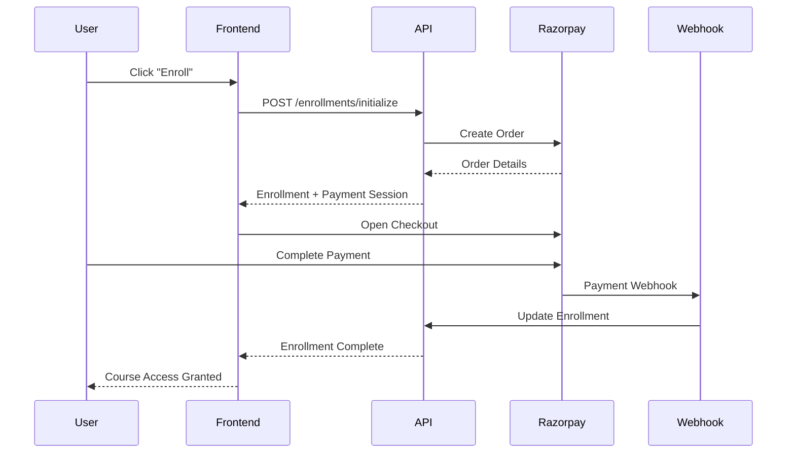

# 🗺️ LMS Enrollment System Implementation Roadmap

## 📋 Executive Summary

This roadmap provides a comprehensive implementation strategy for building a scalable LMS enrollment workflow with Razorpay payment integration, based on best practices from leading platforms like Udemy, Coursera, and LinkedIn Learning.

## 📚 Documentation Structure

### 1. **[LMS_ENROLLMENT_WORKFLOW_PRD.md](./LMS_ENROLLMENT_WORKFLOW_PRD.md)**

- Complete Product Requirements Document
- Platform analysis (Udemy, Coursera, LinkedIn Learning)
- Workflow design and data flow architecture
- Technical architecture and design patterns
- Security, compliance, and analytics requirements

### 2. **[ENROLLMENT_IMPLEMENTATION_GUIDE.md](./ENROLLMENT_IMPLEMENTATION_GUIDE.md)**

- Step-by-step implementation instructions
- Database schema updates
- Service layer enhancements
- Razorpay integration details
- Frontend integration examples

### 3. **[ENROLLMENT_API_EXAMPLES.md](./ENROLLMENT_API_EXAMPLES.md)**

- Complete API request/response examples
- Error handling scenarios
- Test cases and validation
- Performance and security testing

## 🎯 Key Implementation Insights

### How Major Platforms Handle Enrollment

#### **Udemy's Multi-Course Cart Model**

```
Course Discovery → Add to Cart → Apply Coupons → Checkout → Payment → Instant Access
```

- **Strengths**: Bulk purchasing, aggressive discounting
- **Implementation**: Shopping cart functionality with coupon stacking

#### **Coursera's Subscription-First Approach**

```
Course Browse → Free Preview → Subscription/Purchase → Certificate Options
```

- **Strengths**: Recurring revenue, trial periods, financial aid
- **Implementation**: Freemium model with premium upgrades

#### **LinkedIn Learning's Seamless Integration**

```
Discovery → Premium Check → Instant Access (if subscribed)
```

- **Strengths**: Zero-friction for subscribers, corporate accounts
- **Implementation**: Subscription-based with enterprise features

### **Best Practices Identified**

1. **Progressive Disclosure**: Show pricing and requirements gradually
2. **Payment Flexibility**: Multiple payment methods and options
3. **Error Recovery**: Graceful handling of payment failures
4. **Mobile Optimization**: Touch-friendly payment experience
5. **Instant Gratification**: Immediate course access upon payment
6. **Trust Building**: Clear refund policies and security indicators

## 🚀 Implementation Strategy

### Phase 1: Foundation (Week 1-2)

**Goal**: Establish core enrollment workflow

#### **Database Schema**

```sql
-- Enhanced enrollment table
ALTER TABLE enrollments ADD COLUMN enrollment_expires_at TIMESTAMP;
CREATE INDEX idx_enrollments_user_course ON enrollments(user_id, internship_id);
CREATE INDEX idx_enrollments_payment_lookup ON enrollments(payment_id);
```

#### **Core API Endpoints**

- `POST /api/v1/enrollments/initialize` - Start enrollment process
- `GET /api/v1/enrollments/{id}/status` - Check enrollment status
- `POST /api/v1/enrollments/{id}/retry` - Retry failed payments

#### **Razorpay Integration**

- Enhanced order creation with proper metadata
- Webhook signature validation
- Payment status synchronization

### Phase 2: Enhanced Features (Week 3-4)

**Goal**: Add advanced functionality

#### **Discount System**

```go
type DiscountCalculator interface {
    CalculateDiscount(originalAmount decimal.Decimal, coupons []string) (*DiscountResult, error)
    ValidateCoupon(code string, courseID string, userID string) (*CouponValidation, error)
}
```

#### **Error Recovery**

- Automatic payment retry logic
- User-friendly error messages
- Alternative payment method suggestions

#### **Mobile Optimization**

- Progressive Web App support
- Touch-optimized payment flow
- Offline enrollment queuing

### Phase 3: Scale & Analytics (Week 5-6)

**Goal**: Optimize for production

#### **Performance Monitoring**

```go
// Metrics to track
- enrollment_initiations_total
- enrollment_completions_total
- payment_processing_duration_seconds
- enrollment_conversion_rate
```

#### **Analytics Dashboard**

- Real-time enrollment metrics
- Payment success rates by method
- Course popularity analytics
- Revenue tracking

### Phase 4: Enterprise Features (Week 7-8)

**Goal**: B2B capabilities

#### **Bulk Enrollment**

- Corporate account management
- Bulk payment processing
- Invoice generation
- Usage reporting

## 🔄 API Workflow Summary

### **Standard Enrollment Flow**



### **Key API Calls Order**

1. **Course Information**: `GET /api/v1/internships/{courseId}`
2. **Initialize Enrollment**: `POST /api/v1/enrollments/initialize`
3. **Process Payment**: Frontend Razorpay integration
4. **Webhook Processing**: Backend payment confirmation
5. **Status Check**: `GET /api/v1/enrollments/{id}/status`
6. **Course Access**: `GET /api/v1/courses/{courseId}/access`

## 💰 Razorpay Integration Deep Dive

### **Order Creation Strategy**

```go
func (r *RazorpayProvider) CreateEnrollmentOrder(ctx context.Context, req *EnrollmentPaymentRequest) (*OrderResponse, error) {
    orderData := map[string]interface{}{
        "amount":          req.Amount * 100, // Convert to paise
        "currency":        req.Currency,
        "receipt":         req.IdempotencyKey,
        "payment_capture": 1, // Auto-capture
        "notes": map[string]string{
            "enrollment_id": req.EnrollmentID,
            "course_id":     req.CourseID,
            "user_id":       req.UserID,
        },
    }

    return r.razorpayClient.Order.Create(orderData, nil)
}
```

### **Webhook Processing**

```go
func (w *WebhookHandler) HandlePaymentSuccess(event *RazorpayEvent) error {
    enrollmentID := event.Payload.Order.Notes["enrollment_id"]

    // Update payment status
    payment.Status = "completed"
    payment.GatewayPaymentID = event.Payload.Payment.ID

    // Complete enrollment
    enrollment.Status = "enrolled"
    enrollment.EnrolledAt = time.Now()

    // Grant course access
    return w.grantCourseAccess(enrollmentID)
}
```

### **Frontend Integration**

```javascript
// Complete enrollment flow
const enrollCourse = async (courseId) => {
  // 1. Initialize enrollment
  const enrollment = await initializeEnrollment(courseId);

  // 2. Process payment (if required)
  if (enrollment.payment_required) {
    await processRazorpayPayment(enrollment.payment_session);
  }

  // 3. Verify completion
  const status = await checkEnrollmentStatus(enrollment.enrollment_id);

  // 4. Redirect to course
  if (status.enrollment_status === "enrolled") {
    window.location.href = status.course_access.next_lesson_url;
  }
};
```

## 🧪 Testing Strategy

### **Test Pyramid**

#### **Unit Tests (70%)**

- Service layer logic
- Payment calculations
- Validation functions
- Error handling

#### **Integration Tests (20%)**

- Database operations
- External API calls
- Webhook processing
- Payment flow end-to-end

#### **E2E Tests (10%)**

- Complete user journeys
- Cross-browser testing
- Mobile responsive testing
- Performance testing

### **Critical Test Scenarios**

```javascript
// Essential test cases
describe("Enrollment Workflow", () => {
  test("Successful paid course enrollment");
  test("Free course immediate enrollment");
  test("Duplicate enrollment prevention");
  test("Payment failure recovery");
  test("Webhook processing reliability");
  test("Coupon application accuracy");
  test("Mobile payment experience");
});
```

## 📊 Success Metrics

### **Technical KPIs**

- **API Response Time**: < 200ms for enrollment APIs
- **Payment Success Rate**: > 95% across all methods
- **System Uptime**: 99.9% availability
- **Error Rate**: < 1% for critical flows

### **Business KPIs**

- **Conversion Rate**: > 15% from course view to enrollment
- **Payment Abandonment**: < 10% at checkout
- **User Satisfaction**: > 4.5/5 rating
- **Revenue Growth**: Measurable increase in enrollments

### **Monitoring Dashboard**

```go
// Key metrics to track
type EnrollmentMetrics struct {
    InitiationsToday     int64   `json:"initiations_today"`
    CompletionsToday     int64   `json:"completions_today"`
    ConversionRate       float64 `json:"conversion_rate"`
    AverageProcessingTime time.Duration `json:"avg_processing_time"`
    PaymentSuccessRate   float64 `json:"payment_success_rate"`
    RevenueToday         decimal.Decimal `json:"revenue_today"`
}
```

## 🔒 Security & Compliance

### **Payment Security**

- PCI DSS compliance through Razorpay
- Webhook signature validation
- Encrypted data transmission
- Audit logging for all transactions

### **Data Protection**

- GDPR compliance for EU users
- Data encryption at rest and transit
- User consent management
- Right to be forgotten implementation

### **Fraud Prevention**

```go
type FraudDetection struct {
    RiskScoring    RiskEngine
    VelocityChecks VelocityLimiter
    GeoValidation  LocationValidator
}
```

## 🚀 Deployment Checklist

### **Pre-Production**

- [ ] Database migrations tested
- [ ] Razorpay sandbox integration working
- [ ] Webhook endpoints configured
- [ ] SSL certificates installed
- [ ] Monitoring dashboards deployed

### **Production Deployment**

- [ ] Environment variables configured
- [ ] Razorpay production keys added
- [ ] Load balancer configured
- [ ] CDN setup for static assets
- [ ] Backup procedures tested

### **Post-Deployment**

- [ ] Smoke tests passed
- [ ] Monitoring alerts configured
- [ ] Error tracking enabled
- [ ] Performance baselines established
- [ ] Documentation updated

## 🎯 Future Enhancements

### **Phase 5: Advanced Features**

- **AI-Powered Recommendations**: Course suggestions based on enrollment patterns
- **Dynamic Pricing**: Time-based and demand-based pricing
- **Social Learning**: Group enrollments and peer interactions
- **Gamification**: Achievement badges and learning streaks

### **Phase 6: Global Expansion**

- **Multi-Currency Support**: Automatic currency conversion
- **Regional Payment Methods**: Local payment preferences
- **Localization**: Multi-language support
- **Compliance**: Regional legal requirements

## 📝 Implementation Priority

### **High Priority (Must Have)**

1. ✅ Basic enrollment workflow
2. ✅ Razorpay payment integration
3. ✅ Error handling and retry logic
4. ✅ Mobile-responsive design

### **Medium Priority (Should Have)**

1. 📋 Coupon and discount system
2. 📋 Analytics and reporting
3. 📋 Performance optimization
4. 📋 Security enhancements

### **Low Priority (Nice to Have)**

1. 🔮 Bulk enrollment features
2. 🔮 Advanced analytics
3. 🔮 AI recommendations
4. 🔮 Social features

## 🤝 Team Responsibilities

### **Backend Team**

- API development and optimization
- Database schema and migrations
- Payment gateway integration
- Security implementation

### **Frontend Team**

- User interface development
- Payment flow optimization
- Mobile responsiveness
- Error handling UX

### **DevOps Team**

- Infrastructure setup
- Monitoring and alerting
- Deployment automation
- Performance optimization

### **QA Team**

- Test case development
- End-to-end testing
- Performance testing
- Security testing

## 📞 Support & Maintenance

### **Monitoring**

- Real-time system health dashboards
- Payment processing alerts
- Error rate monitoring
- Performance metrics tracking

### **Incident Response**

- 24/7 payment processing monitoring
- Escalation procedures for failures
- Rollback procedures for deployments
- Communication plan for outages

This roadmap provides a comprehensive strategy for implementing a world-class LMS enrollment system that can scale with your business growth and compete with industry leaders.
