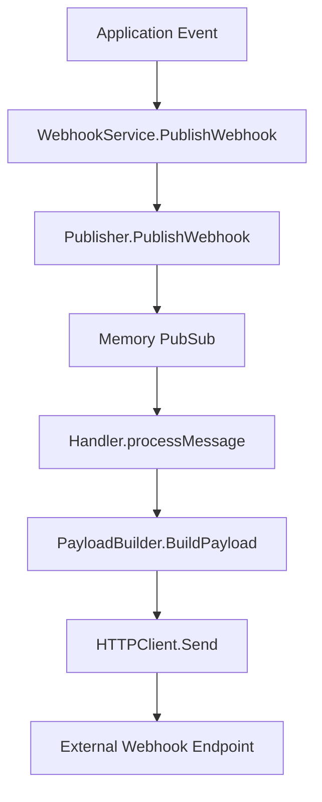
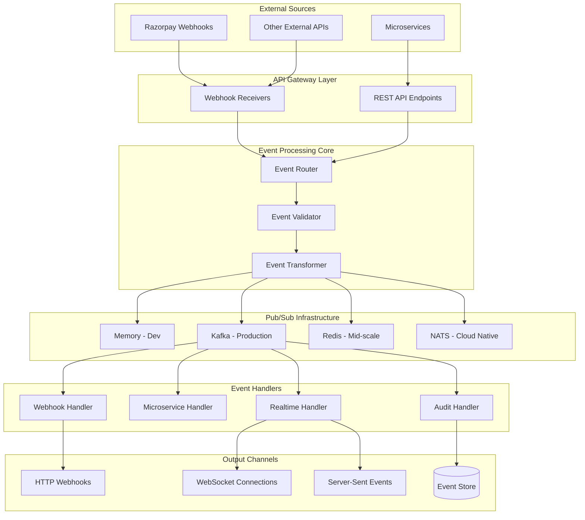
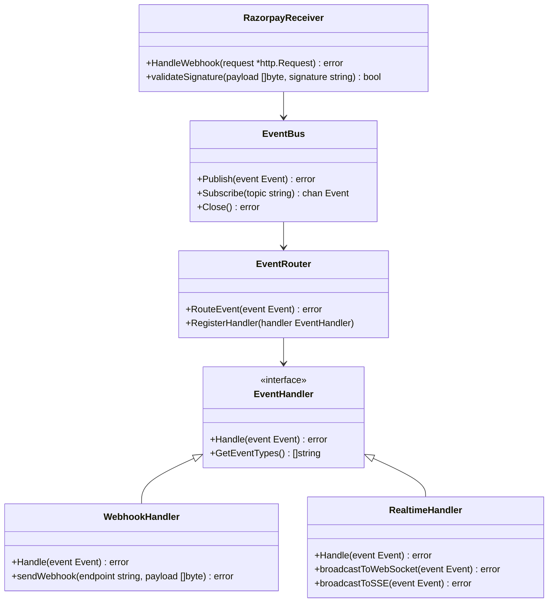
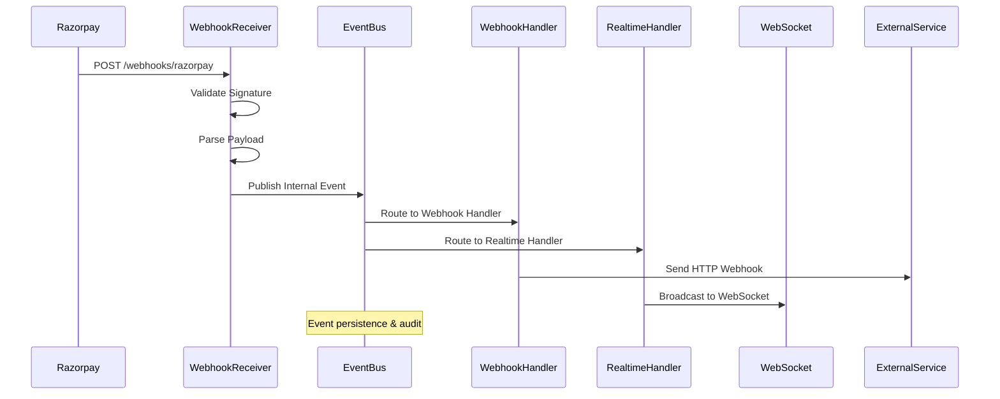
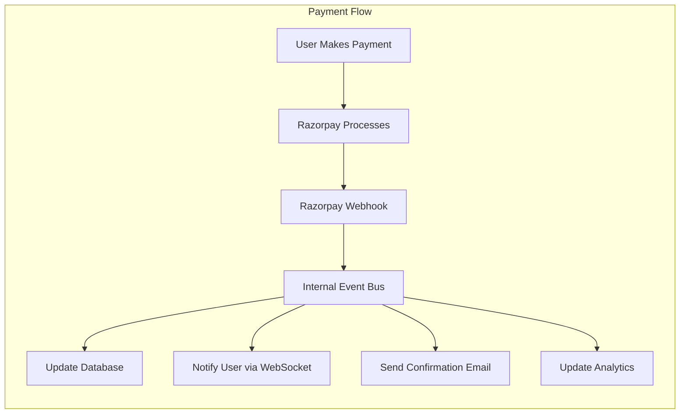

# Event-Driven PubSub System Implementation Guide

## Table of Contents

1. [Overview](#overview)
2. [Current System Analysis](#current-system-analysis)
3. [Proposed System Architecture](#proposed-system-architecture)
4. [Implementation Guide](#implementation-guide)
5. [Component Interactions](#component-interactions)
6. [Integration Examples](#integration-examples)
7. [Testing Strategy](#testing-strategy)
8. [Deployment Guide](#deployment-guide)

## Overview

This document provides a comprehensive guide for implementing a robust, scalable event-driven system using Watermill for pub/sub operations. The system is designed to handle external service integrations (particularly Razorpay webhooks), microservice communication, and real-time frontend updates.

### Goals

- **Scalability**: Handle high-volume event processing
- **Reliability**: Ensure message delivery with retry mechanisms
- **Flexibility**: Support multiple pub/sub backends
- **Real-time**: Enable live updates to frontend applications
- **Integration**: Seamless external service webhook handling

## Current System Analysis

### Existing Architecture

```
Current Webhook System
├── webhook/
│   ├── module.go           # Dependency injection setup
│   ├── service.go          # Main orchestration service
│   ├── publisher/          # Event publishing logic
│   │   └── publisher.go    # WebhookPublisher implementation
│   ├── handler/            # Event processing logic
│   │   └── handler.go      # Message handler with HTTP webhook delivery
│   ├── payload/            # Dynamic payload building
│   │   ├── factory.go      # PayloadBuilderFactory
│   │   ├── builder.go      # PayloadBuilder interface
│   │   └── services.go     # Service dependencies
│   └── dto/                # Data transfer objects
       └── user.go          # User-specific DTOs
```

### Current Flow



### Current Strengths

- ✅ Clean modular architecture with dependency injection
- ✅ Configurable user-specific webhook endpoints
- ✅ Dynamic payload building based on event types
- ✅ Retry mechanisms with exponential backoff
- ✅ Structured logging and error handling
- ✅ Dead letter queue for failed messages

### Current Limitations

- ❌ In-memory only (not production-ready for scale)
- ❌ No external webhook ingestion capability
- ❌ No real-time frontend connectivity
- ❌ Limited to HTTP webhook delivery only
- ❌ No event sourcing or audit trail
- ❌ Single node limitation (no horizontal scaling)

## Proposed System Architecture

### High-Level Architecture



### Component Architecture



## Implementation Guide

### Phase 1: Enhanced PubSub Backend Support

#### 1.1 Create PubSub Interface Abstraction

Create `internal/pubsub/factory.go`:

```go
package pubsub

import (
    "context"
    "fmt"

    "github.com/omkar273/codegeeky/internal/config"
    "github.com/omkar273/codegeeky/internal/logger"
    "github.com/omkar273/codegeeky/internal/pubsub/kafka"
    "github.com/omkar273/codegeeky/internal/pubsub/memory"
    "github.com/omkar273/codegeeky/internal/pubsub/redis"
    "github.com/omkar273/codegeeky/internal/types"
)

type Factory interface {
    CreatePubSub(backend types.PubSubType) PubSub
}

type factory struct {
    config *config.Configuration
    logger *logger.Logger
}

func NewFactory(cfg *config.Configuration, logger *logger.Logger) Factory {
    return &factory{
        config: cfg,
        logger: logger,
    }
}

func (f *factory) CreatePubSub(backend types.PubSubType) PubSub {
    switch backend {
    case types.MemoryPubSub:
        return memory.NewPubSub(f.config, f.logger)
    case types.KafkaPubSub:
        return kafka.NewPubSub(f.config, f.logger)
    case types.RedisPubSub:
        return redis.NewPubSub(f.config, f.logger)
    case types.NATSPubSub:
        return nats.NewPubSub(f.config, f.logger)
    default:
        panic(fmt.Sprintf("unsupported pubsub type: %s", backend))
    }
}
```

#### 1.2 Implement Kafka Backend

Create `internal/pubsub/kafka/pubsub.go`:

```go
package kafka

import (
    "context"
    "encoding/json"

    "github.com/Shopify/sarama"
    "github.com/ThreeDotsLabs/watermill"
    "github.com/ThreeDotsLabs/watermill-kafka/v2/pkg/kafka"
    "github.com/ThreeDotsLabs/watermill/message"
    "github.com/omkar273/codegeeky/internal/config"
    "github.com/omkar273/codegeeky/internal/logger"
    "github.com/omkar273/codegeeky/internal/pubsub"
)

type PubSub struct {
    publisher  *kafka.Publisher
    subscriber *kafka.Subscriber
    config     *config.Kafka
    logger     *logger.Logger
}

func NewPubSub(cfg *config.Configuration, logger *logger.Logger) pubsub.PubSub {
    saramaConfig := sarama.NewConfig()
    saramaConfig.Producer.Return.Successes = true
    saramaConfig.Producer.RequiredAcks = sarama.WaitForAll
    saramaConfig.Producer.Retry.Max = 3
    saramaConfig.Consumer.Group.Rebalance.Strategy = sarama.BalanceStrategyRoundRobin

    publisher, err := kafka.NewPublisher(
        kafka.PublisherConfig{
            Brokers:   cfg.Kafka.Brokers,
            Marshaler: kafka.DefaultMarshaler{},
        },
        watermill.NewStdLogger(false, false),
    )
    if err != nil {
        logger.Fatal("failed to create kafka publisher", "error", err)
    }

    subscriber, err := kafka.NewSubscriber(
        kafka.SubscriberConfig{
            Brokers:       cfg.Kafka.Brokers,
            Unmarshaler:   kafka.DefaultMarshaler{},
            ConsumerGroup: cfg.Kafka.ConsumerGroup,
        },
        watermill.NewStdLogger(false, false),
    )
    if err != nil {
        logger.Fatal("failed to create kafka subscriber", "error", err)
    }

    return &PubSub{
        publisher:  publisher,
        subscriber: subscriber,
        config:     &cfg.Kafka,
        logger:     logger,
    }
}

func (p *PubSub) Publish(ctx context.Context, topic string, msg *message.Message) error {
    return p.publisher.Publish(topic, msg)
}

func (p *PubSub) Subscribe(ctx context.Context, topic string) (<-chan *message.Message, error) {
    return p.subscriber.Subscribe(ctx, topic)
}

func (p *PubSub) Close() error {
    if err := p.publisher.Close(); err != nil {
        return err
    }
    return p.subscriber.Close()
}
```

### Phase 2: External Webhook Integration

#### 2.1 Razorpay Webhook Receiver

Create `internal/webhook/receivers/razorpay.go`:

```go
package receivers

import (
    "context"
    "crypto/hmac"
    "crypto/sha256"
    "encoding/hex"
    "encoding/json"
    "fmt"
    "io"
    "net/http"
    "time"

    "github.com/omkar273/codegeeky/internal/config"
    "github.com/omkar273/codegeeky/internal/logger"
    "github.com/omkar273/codegeeky/internal/types"
    "github.com/omkar273/codegeeky/internal/webhook/publisher"
)

type RazorpayReceiver struct {
    config    *config.Razorpay
    publisher publisher.WebhookPublisher
    logger    *logger.Logger
}

type RazorpayWebhookPayload struct {
    Event   string          `json:"event"`
    Entity  string          `json:"entity"`
    Account AccountInfo     `json:"account"`
    Payment json.RawMessage `json:"payment,omitempty"`
    Order   json.RawMessage `json:"order,omitempty"`
    Refund  json.RawMessage `json:"refund,omitempty"`
}

type AccountInfo struct {
    ID string `json:"id"`
}

func NewRazorpayReceiver(
    cfg *config.Configuration,
    publisher publisher.WebhookPublisher,
    logger *logger.Logger,
) *RazorpayReceiver {
    return &RazorpayReceiver{
        config:    &cfg.Razorpay,
        publisher: publisher,
        logger:    logger,
    }
}

func (r *RazorpayReceiver) HandleWebhook(w http.ResponseWriter, req *http.Request) {
    ctx := req.Context()

    // Read request body
    body, err := io.ReadAll(req.Body)
    if err != nil {
        r.logger.Errorw("failed to read webhook body", "error", err)
        http.Error(w, "Bad Request", http.StatusBadRequest)
        return
    }

    // Validate signature
    signature := req.Header.Get("X-Razorpay-Signature")
    if !r.validateSignature(body, signature) {
        r.logger.Warnw("invalid webhook signature", "signature", signature)
        http.Error(w, "Unauthorized", http.StatusUnauthorized)
        return
    }

    // Parse webhook payload
    var payload RazorpayWebhookPayload
    if err := json.Unmarshal(body, &payload); err != nil {
        r.logger.Errorw("failed to parse webhook payload", "error", err)
        http.Error(w, "Bad Request", http.StatusBadRequest)
        return
    }

    // Convert to internal event format
    event := r.convertToInternalEvent(payload)

    // Publish to internal event bus
    if err := r.publisher.PublishWebhook(ctx, event); err != nil {
        r.logger.Errorw("failed to publish webhook event", "error", err)
        http.Error(w, "Internal Server Error", http.StatusInternalServerError)
        return
    }

    r.logger.Infow("razorpay webhook processed successfully",
        "event", payload.Event,
        "entity", payload.Entity,
    )

    w.WriteHeader(http.StatusOK)
    w.Write([]byte("OK"))
}

func (r *RazorpayReceiver) validateSignature(payload []byte, signature string) bool {
    expectedSignature := r.generateSignature(payload)
    return hmac.Equal([]byte(expectedSignature), []byte(signature))
}

func (r *RazorpayReceiver) generateSignature(payload []byte) string {
    h := hmac.New(sha256.New, []byte(r.config.WebhookSecret))
    h.Write(payload)
    return hex.EncodeToString(h.Sum(nil))
}

func (r *RazorpayReceiver) convertToInternalEvent(payload RazorpayWebhookPayload) *types.WebhookEvent {
    return &types.WebhookEvent{
        ID:        fmt.Sprintf("rzp_%d", time.Now().UnixNano()),
        EventName: fmt.Sprintf("razorpay.%s", payload.Event),
        UserID:    &payload.Account.ID, // Map to your user ID logic
        Payload:   payload,
        CreatedAt: time.Now(),
    }
}
```

#### 2.2 Enhanced Event Types

Update `internal/types/events.go`:

```go
package types

import (
    "encoding/json"
    "time"
)

// EventSource defines the source of an event
type EventSource string

const (
    EventSourceInternal  EventSource = "internal"
    EventSourceRazorpay  EventSource = "razorpay"
    EventSourceExternal  EventSource = "external"
    EventSourceSystem    EventSource = "system"
)

// Enhanced WebhookEvent with more metadata
type WebhookEvent struct {
    ID          string          `json:"id"`
    EventName   string          `json:"event_name"`
    Source      EventSource     `json:"source"`
    UserID      *string         `json:"user_id,omitempty"`
    Payload     interface{}     `json:"payload"`
    Metadata    EventMetadata   `json:"metadata"`
    CreatedAt   time.Time       `json:"created_at"`
    ProcessedAt *time.Time      `json:"processed_at,omitempty"`
}

type EventMetadata struct {
    Version       string            `json:"version"`
    CorrelationID string            `json:"correlation_id"`
    TraceID       string            `json:"trace_id"`
    Headers       map[string]string `json:"headers,omitempty"`
    RetryCount    int               `json:"retry_count"`
}

// Razorpay specific event types
type RazorpayPaymentEvent struct {
    Event   string `json:"event"`
    Entity  string `json:"entity"`
    Payment struct {
        ID          string  `json:"id"`
        Amount      int     `json:"amount"`
        Currency    string  `json:"currency"`
        Status      string  `json:"status"`
        OrderID     string  `json:"order_id"`
        Email       string  `json:"email"`
        Contact     string  `json:"contact"`
        Fee         int     `json:"fee"`
        Tax         int     `json:"tax"`
        Description string  `json:"description"`
        CreatedAt   int64   `json:"created_at"`
    } `json:"payment"`
}

// Internal application events
type UserCreatedEvent struct {
    UserID    string    `json:"user_id"`
    Email     string    `json:"email"`
    Name      string    `json:"name"`
    CreatedAt time.Time `json:"created_at"`
}

type PaymentProcessedEvent struct {
    PaymentID   string  `json:"payment_id"`
    UserID      string  `json:"user_id"`
    Amount      float64 `json:"amount"`
    Currency    string  `json:"currency"`
    Status      string  `json:"status"`
    Gateway     string  `json:"gateway"`
    ProcessedAt time.Time `json:"processed_at"`
}
```

### Phase 3: Real-time Frontend Integration

#### 3.1 WebSocket Gateway

Create `internal/realtime/websocket.go`:

```go
package realtime

import (
    "context"
    "encoding/json"
    "net/http"
    "sync"
    "time"

    "github.com/gorilla/websocket"
    "github.com/omkar273/codegeeky/internal/auth"
    "github.com/omkar273/codegeeky/internal/config"
    "github.com/omkar273/codegeeky/internal/logger"
    "github.com/omkar273/codegeeky/internal/pubsub"
    "github.com/omkar273/codegeeky/internal/types"
)

type WebSocketGateway struct {
    connections map[string]*websocket.Conn
    mu          sync.RWMutex
    pubsub      pubsub.PubSub
    auth        auth.AuthProvider
    config      *config.Realtime
    logger      *logger.Logger
    upgrader    websocket.Upgrader
}

type ClientMessage struct {
    Type    string      `json:"type"`
    Payload interface{} `json:"payload"`
}

type SubscriptionRequest struct {
    EventTypes []string `json:"event_types"`
    UserID     string   `json:"user_id"`
}

func NewWebSocketGateway(
    pubsub pubsub.PubSub,
    auth auth.AuthProvider,
    cfg *config.Configuration,
    logger *logger.Logger,
) *WebSocketGateway {
    upgrader := websocket.Upgrader{
        CheckOrigin: func(r *http.Request) bool {
            origin := r.Header.Get("Origin")
            for _, allowed := range cfg.Realtime.AllowedOrigins {
                if origin == allowed {
                    return true
                }
            }
            return false
        },
    }

    gateway := &WebSocketGateway{
        connections: make(map[string]*websocket.Conn),
        pubsub:      pubsub,
        auth:        auth,
        config:      &cfg.Realtime,
        logger:      logger,
        upgrader:    upgrader,
    }

    // Start listening to events
    go gateway.listenToEvents()

    return gateway
}

func (w *WebSocketGateway) HandleConnection(rw http.ResponseWriter, r *http.Request) {
    // Authenticate user
    userID, err := w.authenticateRequest(r)
    if err != nil {
        w.logger.Warnw("websocket authentication failed", "error", err)
        http.Error(rw, "Unauthorized", http.StatusUnauthorized)
        return
    }

    // Upgrade connection
    conn, err := w.upgrader.Upgrade(rw, r, nil)
    if err != nil {
        w.logger.Errorw("websocket upgrade failed", "error", err)
        return
    }

    // Register connection
    w.mu.Lock()
    w.connections[userID] = conn
    w.mu.Unlock()

    w.logger.Infow("websocket connection established", "user_id", userID)

    // Handle client messages
    go w.handleClientMessages(userID, conn)

    // Handle connection cleanup
    defer func() {
        w.mu.Lock()
        delete(w.connections, userID)
        w.mu.Unlock()
        conn.Close()
        w.logger.Infow("websocket connection closed", "user_id", userID)
    }()

    // Keep connection alive
    for {
        if err := conn.WriteMessage(websocket.PingMessage, nil); err != nil {
            break
        }
        time.Sleep(30 * time.Second)
    }
}

func (w *WebSocketGateway) listenToEvents() {
    ctx := context.Background()
    messages, err := w.pubsub.Subscribe(ctx, "realtime.events")
    if err != nil {
        w.logger.Errorw("failed to subscribe to realtime events", "error", err)
        return
    }

    for msg := range messages {
        var event types.WebhookEvent
        if err := json.Unmarshal(msg.Payload, &event); err != nil {
            w.logger.Errorw("failed to unmarshal event", "error", err)
            continue
        }

        // Broadcast to relevant connections
        w.broadcastToUser(event)
    }
}

func (w *WebSocketGateway) broadcastToUser(event types.WebhookEvent) {
    if event.UserID == nil {
        return
    }

    w.mu.RLock()
    conn, exists := w.connections[*event.UserID]
    w.mu.RUnlock()

    if !exists {
        return
    }

    message := ClientMessage{
        Type:    "event",
        Payload: event,
    }

    if err := conn.WriteJSON(message); err != nil {
        w.logger.Errorw("failed to send websocket message",
            "user_id", *event.UserID,
            "error", err,
        )
    }
}

func (w *WebSocketGateway) authenticateRequest(r *http.Request) (string, error) {
    token := r.Header.Get("Authorization")
    if token == "" {
        token = r.URL.Query().Get("token")
    }

    user, err := w.auth.ValidateToken(r.Context(), token)
    if err != nil {
        return "", err
    }

    return user.ID, nil
}

func (w *WebSocketGateway) handleClientMessages(userID string, conn *websocket.Conn) {
    for {
        var msg ClientMessage
        if err := conn.ReadJSON(&msg); err != nil {
            w.logger.Debugw("websocket read error", "user_id", userID, "error", err)
            break
        }

        w.logger.Debugw("received client message",
            "user_id", userID,
            "type", msg.Type,
        )

        // Handle different message types
        switch msg.Type {
        case "subscribe":
            // Handle subscription logic
        case "unsubscribe":
            // Handle unsubscription logic
        case "ping":
            // Respond with pong
            conn.WriteJSON(ClientMessage{Type: "pong"})
        }
    }
}
```

## Component Interactions

### Event Flow Diagram



### Integration Flow Example



## Integration Examples

### Example 1: Razorpay Payment Success Flow

```go
// 1. Razorpay sends webhook
POST /api/webhooks/razorpay
Content-Type: application/json
X-Razorpay-Signature: 3c3b5d0c...

{
  "event": "payment.captured",
  "entity": "event",
  "account": {"id": "acc_123"},
  "payment": {
    "id": "pay_456",
    "amount": 50000,
    "currency": "INR",
    "status": "captured",
    "order_id": "order_789"
  }
}

// 2. Converted to internal event
{
  "id": "evt_razorpay_1642678800000",
  "event_name": "razorpay.payment.captured",
  "source": "razorpay",
  "user_id": "user_123",
  "payload": { /* razorpay payload */ },
  "metadata": {
    "version": "1.0",
    "correlation_id": "corr_456",
    "trace_id": "trace_789"
  },
  "created_at": "2024-01-20T10:30:00Z"
}

// 3. Processed by handlers
// - WebhookHandler: Send to configured user webhooks
// - RealtimeHandler: Push to user's WebSocket connection
// - PaymentHandler: Update payment status in database
// - NotificationHandler: Send confirmation email
```

### Example 2: Real-time User Notification

```javascript
// Frontend WebSocket connection
const ws = new WebSocket("ws://localhost:8080/ws?token=jwt_token");

ws.onmessage = function (event) {
  const message = JSON.parse(event.data);

  if (message.type === "event") {
    const eventData = message.payload;

    switch (eventData.event_name) {
      case "razorpay.payment.captured":
        showPaymentSuccess(eventData.payload);
        break;
      case "user.profile.updated":
        refreshUserProfile();
        break;
      default:
        console.log("Received event:", eventData);
    }
  }
};

function showPaymentSuccess(paymentData) {
  // Display success notification
  showNotification({
    type: "success",
    title: "Payment Successful!",
    message: `Payment of ₹${paymentData.payment.amount / 100} received.`,
  });

  // Update UI state
  updatePaymentStatus("completed");
}
```

### Example 3: Microservice Event Publishing

```go
// Publishing events from your application
func (s *PaymentService) ProcessPayment(ctx context.Context, req *ProcessPaymentRequest) error {
    // Process payment logic
    payment, err := s.processPaymentLogic(ctx, req)
    if err != nil {
        return err
    }

    // Publish event for other services
    event := &types.WebhookEvent{
        ID:        generateEventID(),
        EventName: "payment.processed",
        Source:    types.EventSourceInternal,
        UserID:    &req.UserID,
        Payload: types.PaymentProcessedEvent{
            PaymentID:   payment.ID,
            UserID:      req.UserID,
            Amount:      payment.Amount,
            Currency:    payment.Currency,
            Status:      payment.Status,
            ProcessedAt: time.Now(),
        },
        Metadata: types.EventMetadata{
            Version:       "1.0",
            CorrelationID: getCorrelationID(ctx),
            TraceID:       getTraceID(ctx),
        },
        CreatedAt: time.Now(),
    }

    return s.eventPublisher.PublishWebhook(ctx, event)
}
```

## Testing Strategy

### Unit Testing Example

```go
func TestRazorpayWebhookProcessing(t *testing.T) {
    // Setup test dependencies
    mockPublisher := &mockWebhookPublisher{}
    receiver := NewRazorpayReceiver(testConfig, mockPublisher, testLogger)

    // Create test webhook payload
    payload := RazorpayWebhookPayload{
        Event:  "payment.captured",
        Entity: "event",
        Payment: json.RawMessage(`{"id":"pay_123","amount":50000}`),
    }

    body, _ := json.Marshal(payload)
    signature := generateTestSignature(body)

    // Create HTTP request
    req := httptest.NewRequest("POST", "/webhooks/razorpay", bytes.NewReader(body))
    req.Header.Set("X-Razorpay-Signature", signature)

    // Execute
    w := httptest.NewRecorder()
    receiver.HandleWebhook(w, req)

    // Assertions
    assert.Equal(t, http.StatusOK, w.Code)
    assert.Equal(t, 1, mockPublisher.publishCount)
    assert.Equal(t, "razorpay.payment.captured", mockPublisher.lastEvent.EventName)
}
```

### Integration Testing

```go
func TestEndToEndEventFlow(t *testing.T) {
    // Setup complete system with real components
    pubsub := setupTestPubSub()
    webhookService := setupWebhookService(pubsub)
    realtimeGateway := setupRealtimeGateway(pubsub)

    // Start services
    ctx, cancel := context.WithTimeout(context.Background(), 30*time.Second)
    defer cancel()

    go webhookService.Start(ctx)
    go realtimeGateway.Start(ctx)

    // Simulate external webhook
    event := createTestRazorpayEvent()
    err := simulateWebhookReceival(event)
    require.NoError(t, err)

    // Verify event processing
    select {
    case processedEvent := <-getProcessedEvents():
        assert.Equal(t, event.ID, processedEvent.ID)
    case <-time.After(5 * time.Second):
        t.Fatal("Event processing timeout")
    }
}
```

## Deployment Guide

### Docker Configuration

```dockerfile
# Dockerfile
FROM golang:1.21-alpine AS builder

WORKDIR /app
COPY go.mod go.sum ./
RUN go mod download

COPY . .
RUN CGO_ENABLED=0 GOOS=linux go build -o main ./cmd/server

FROM alpine:latest
RUN apk --no-cache add ca-certificates
WORKDIR /root/

COPY --from=builder /app/main .
COPY --from=builder /app/config ./config

CMD ["./main"]
```

### Docker Compose for Development

```yaml
version: "3.8"

services:
  app:
    build: .
    ports:
      - "8080:8080"
    environment:
      - PUBSUB_BACKEND=kafka
      - KAFKA_BROKERS=kafka:9092
    depends_on:
      - kafka
      - redis
      - postgres
    volumes:
      - ./config:/app/config

  kafka:
    image: confluentinc/cp-kafka:latest
    environment:
      KAFKA_ZOOKEEPER_CONNECT: zookeeper:2181
      KAFKA_ADVERTISED_LISTENERS: PLAINTEXT://kafka:9092
      KAFKA_OFFSETS_TOPIC_REPLICATION_FACTOR: 1
    depends_on:
      - zookeeper

  zookeeper:
    image: confluentinc/cp-zookeeper:latest
    environment:
      ZOOKEEPER_CLIENT_PORT: 2181

  redis:
    image: redis:7-alpine
    ports:
      - "6379:6379"

  postgres:
    image: postgres:15
    environment:
      POSTGRES_DB: app_db
      POSTGRES_USER: app_user
      POSTGRES_PASSWORD: app_password
    ports:
      - "5432:5432"
```

### Kubernetes Deployment

```yaml
# k8s-deployment.yaml
apiVersion: apps/v1
kind: Deployment
metadata:
  name: event-service
spec:
  replicas: 3
  selector:
    matchLabels:
      app: event-service
  template:
    metadata:
      labels:
        app: event-service
    spec:
      containers:
        - name: event-service
          image: your-registry/event-service:latest
          ports:
            - containerPort: 8080
          env:
            - name: PUBSUB_BACKEND
              value: "kafka"
            - name: KAFKA_BROKERS
              value: "kafka-service:9092"
          resources:
            requests:
              memory: "256Mi"
              cpu: "250m"
            limits:
              memory: "512Mi"
              cpu: "500m"
---
apiVersion: v1
kind: Service
metadata:
  name: event-service
spec:
  selector:
    app: event-service
  ports:
    - port: 80
      targetPort: 8080
  type: LoadBalancer
```

### Monitoring and Observability

```yaml
# prometheus-config.yml
global:
  scrape_interval: 15s

scrape_configs:
  - job_name: "event-service"
    static_configs:
      - targets: ["localhost:8080"]
    metrics_path: "/metrics"
```

This comprehensive guide provides everything needed to implement, test, and deploy your enhanced event-driven system. The architecture supports your requirements for Razorpay integration, microservice communication, and real-time frontend updates while maintaining scalability and reliability.
