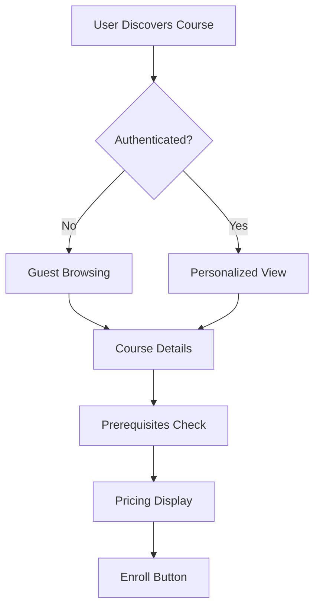
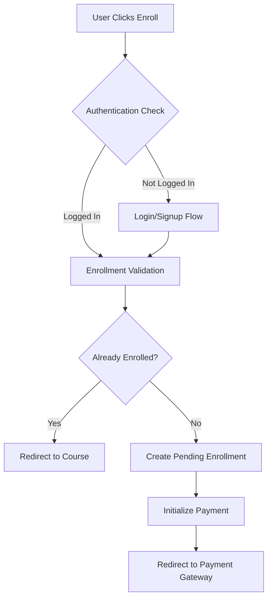
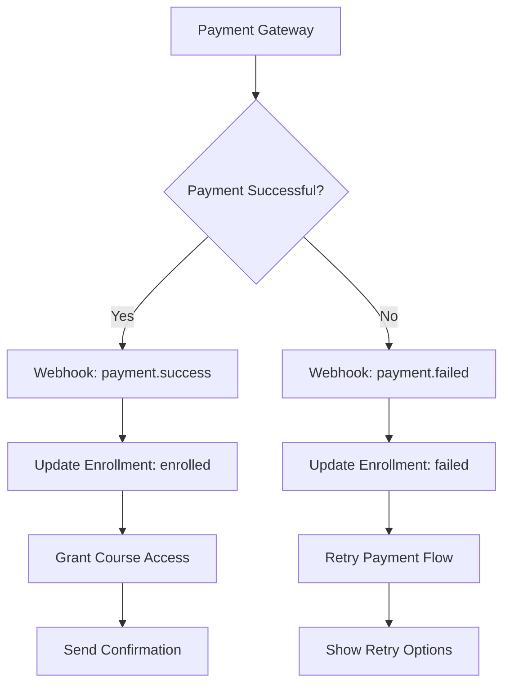

# 🎓 LMS Course Enrollment Workflow with Payment Integration - PRD

## 📋 Executive Summary

This document outlines a comprehensive Product Requirements Document (PRD) for implementing a scalable LMS course enrollment workflow with integrated payment processing using Razorpay. The system is designed based on best practices from leading platforms like Udemy, Coursera, and LinkedIn Learning.

### 🎯 Vision

Create a seamless, scalable, and secure course enrollment experience that handles the complete user journey from course discovery to successful enrollment and payment completion.

### 🔍 Current System Analysis

Based on your existing architecture:

- ✅ Enrollment schema with proper relationships (User ↔ Internship)
- ✅ Comprehensive payment system with domain models
- ✅ Razorpay integration foundation
- ✅ Webhook system for event processing
- ✅ Authorization/Authentication framework
- ✅ Repository pattern with Ent ORM

---

## 🏛️ Platform Architecture Analysis

### How Major Platforms Handle Enrollment Flows

#### **1. Udemy's Approach**

```
Course Discovery → Add to Cart → Checkout → Payment → Enrollment → Course Access
```

- **Key Features:**
  - Shopping cart functionality for multiple courses
  - Coupon application at checkout
  - Guest checkout with account creation post-payment
  - Multiple payment methods (Cards, PayPal, Mobile wallets)
  - Instant access upon successful payment

#### **2. Coursera's Model**

```
Course Browse → Free Preview → Enrollment Decision → Payment/Financial Aid → Access
```

- **Key Features:**
  - Free trial periods for specializations
  - Subscription-based model with course bundles
  - Financial aid application workflow
  - Certificate purchase options
  - Progress tracking from enrollment

#### **3. LinkedIn Learning's Flow**

```
Course Discovery → Premium Check → Trial/Subscribe → Instant Access
```

- **Key Features:**
  - Subscription-first model
  - Seamless LinkedIn profile integration
  - Corporate account management
  - Bulk enrollments for enterprises

### **Best Practices Identified:**

1. **Progressive Disclosure**: Show essential info first, details later
2. **Multiple Payment Options**: Cater to different user preferences
3. **Clear Pricing**: Transparent cost breakdown with discounts
4. **Instant Gratification**: Immediate access post successful payment
5. **Error Recovery**: Graceful handling of payment failures
6. **Mobile Optimization**: Seamless mobile payment experience
7. **Trust Indicators**: Security badges, refund policies
8. **Abandoned Cart Recovery**: Email reminders for incomplete enrollments

---

## 🔄 Complete Enrollment Workflow Design

### **Phase 1: Pre-Enrollment (Course Discovery)**



### **Phase 2: Enrollment Initialization**



### **Phase 3: Payment Processing**



---

## 🚀 API Workflow Definition

### **API Call Sequence for Enrollment**

#### **1. Course Information API**

```http
GET /api/v1/courses/{courseId}
Authorization: Bearer {token} (optional)
```

**Response:**

```json
{
  "course": {
    "id": "int_01234567890",
    "title": "Full Stack Development",
    "price": 4999.0,
    "currency": "INR",
    "discount_price": 2999.0,
    "has_active_discount": true,
    "prerequisites": ["basic_programming"],
    "duration_weeks": 12,
    "enrollment_status": "not_enrolled|enrolled|pending",
    "can_enroll": true,
    "enrollment_deadline": "2024-03-30T23:59:59Z"
  }
}
```

#### **2. Enrollment Initialization API**

```http
POST /api/v1/enrollments/initialize
Authorization: Bearer {token}
Content-Type: application/json
```

**Request:**

```json
{
  "course_id": "int_01234567890",
  "coupon_code": "SAVE50",
  "payment_method_preference": "razorpay",
  "success_url": "https://app.example.com/enrollment/success",
  "cancel_url": "https://app.example.com/enrollment/cancel",
  "metadata": {
    "source": "mobile_app",
    "campaign": "spring_sale"
  }
}
```

**Response:**

```json
{
  "enrollment_id": "enr_01234567890",
  "status": "pending",
  "payment_required": true,
  "final_amount": 2999.0,
  "original_amount": 4999.0,
  "discount_applied": 2000.0,
  "currency": "INR",
  "payment_session": {
    "razorpay_order_id": "order_123456789",
    "payment_url": "https://checkout.razorpay.com/...",
    "expires_at": "2024-01-15T10:30:00Z"
  },
  "idempotency_key": "enr_01234567890_20240115"
}
```

#### **3. Payment Status Check API**

```http
GET /api/v1/enrollments/{enrollmentId}/payment-status
Authorization: Bearer {token}
```

**Response:**

```json
{
  "enrollment_id": "enr_01234567890",
  "enrollment_status": "enrolled",
  "payment_status": "completed",
  "payment_id": "pay_01234567890",
  "razorpay_payment_id": "pay_razorpay123",
  "completed_at": "2024-01-15T10:25:00Z",
  "course_access_url": "/api/v1/courses/int_01234567890/access"
}
```

#### **4. Course Access Verification API**

```http
GET /api/v1/courses/{courseId}/access
Authorization: Bearer {token}
```

**Response:**

```json
{
  "has_access": true,
  "enrollment_date": "2024-01-15T10:25:00Z",
  "access_expires": null,
  "course_progress": 0,
  "next_lesson_url": "/api/v1/courses/int_01234567890/lessons/1"
}
```

---

## 📊 Data Flow Architecture

### **Enrollment Data Flow**

#### **1. Initialization Data**

```json
{
  "user": {
    "id": "usr_01234567890",
    "email": "user@example.com",
    "full_name": "John Doe",
    "phone": "+919876543210"
  },
  "course": {
    "id": "int_01234567890",
    "title": "Full Stack Development",
    "price": 4999.0,
    "instructor": "Jane Smith"
  },
  "pricing": {
    "original_amount": 4999.0,
    "discount_amount": 2000.0,
    "final_amount": 2999.0,
    "currency": "INR",
    "tax_amount": 539.82,
    "total_payable": 3538.82
  },
  "enrollment": {
    "id": "enr_01234567890",
    "status": "pending",
    "expires_at": "2024-01-15T11:00:00Z"
  }
}
```

#### **2. Payment Processing Data**

```json
{
  "payment": {
    "id": "pay_01234567890",
    "idempotency_key": "enr_01234567890_20240115",
    "amount": 3538.82,
    "currency": "INR",
    "destination_type": "enrollment",
    "destination_id": "enr_01234567890",
    "gateway_provider": "razorpay",
    "status": "pending"
  },
  "razorpay_order": {
    "order_id": "order_123456789",
    "amount": 353882, // in paise
    "currency": "INR",
    "notes": {
      "enrollment_id": "enr_01234567890",
      "course_id": "int_01234567890",
      "user_id": "usr_01234567890"
    }
  }
}
```

---

## 🎯 Razorpay Integration Strategy

### **1. Order Creation Flow**

#### **Enhanced Razorpay Provider Implementation**

```go
func (r *RazorpayProvider) CreateEnrollmentOrder(ctx context.Context, req *dto.EnrollmentPaymentRequest) (*dto.RazorpayOrderResponse, error) {
    // Convert to paise (smallest currency unit)
    amountInPaise := int(req.Amount.Mul(decimal.NewFromInt(100)).IntPart())

    orderData := map[string]interface{}{
        "amount":          amountInPaise,
        "currency":        req.Currency,
        "receipt":         req.IdempotencyKey,
        "payment_capture": 1, // Auto capture
        "notes": map[string]string{
            "enrollment_id": req.EnrollmentID,
            "course_id":     req.CourseID,
            "user_id":       req.UserID,
            "user_email":    req.UserEmail,
        },
    }

    order, err := r.razorpayClient.Order.Create(orderData, nil)
    if err != nil {
        return nil, fmt.Errorf("razorpay order creation failed: %w", err)
    }

    return &dto.RazorpayOrderResponse{
        OrderID:       order["id"].(string),
        Amount:        amountInPaise,
        Currency:      req.Currency,
        Key:           r.config.KeyID,
        Name:          "Your Platform Name",
        Description:   fmt.Sprintf("Enrollment for %s", req.CourseName),
        Image:         "https://your-platform.com/logo.png",
        CheckoutURL:   r.generateCheckoutURL(order["id"].(string)),
        CallbackURL:   req.CallbackURL,
        CancelURL:     req.CancelURL,
    }, nil
}
```

### **2. Webhook Handling Strategy**

#### **Webhook Event Processing**

```go
func (r *RazorpayProvider) ProcessWebhook(ctx context.Context, payload []byte, headers map[string]string) (*dto.WebhookResult, error) {
    // Verify webhook signature
    if !r.verifyWebhookSignature(payload, headers["x-razorpay-signature"]) {
        return nil, errors.New("invalid webhook signature")
    }

    var event map[string]interface{}
    if err := json.Unmarshal(payload, &event); err != nil {
        return nil, fmt.Errorf("failed to parse webhook: %w", err)
    }

    eventType := event["event"].(string)

    switch eventType {
    case "payment.captured":
        return r.handlePaymentSuccess(event)
    case "payment.failed":
        return r.handlePaymentFailure(event)
    case "order.paid":
        return r.handleOrderCompletion(event)
    default:
        return &dto.WebhookResult{
            EventName: eventType,
            Processed: false,
            Message:   "Event type not handled",
        }, nil
    }
}

func (r *RazorpayProvider) handlePaymentSuccess(event map[string]interface{}) (*dto.WebhookResult, error) {
    paymentData := event["payload"].(map[string]interface{})["payment"].(map[string]interface{})
    orderData := event["payload"].(map[string]interface{})["order"].(map[string]interface{})

    // Extract enrollment information from order notes
    notes := orderData["notes"].(map[string]interface{})
    enrollmentID := notes["enrollment_id"].(string)

    return &dto.WebhookResult{
        EventName:    "payment.success",
        EventID:      event["id"].(string),
        EnrollmentID: enrollmentID,
        PaymentID:    paymentData["id"].(string),
        Amount:       paymentData["amount"].(float64) / 100, // Convert from paise
        Currency:     paymentData["currency"].(string),
        Processed:    true,
        Payload:      event,
    }, nil
}
```

### **3. Frontend Integration**

#### **React/Next.js Integration Example**

```javascript
// Enrollment initialization
const initializeEnrollment = async (courseId, couponCode = null) => {
  const response = await fetch("/api/v1/enrollments/initialize", {
    method: "POST",
    headers: {
      Authorization: `Bearer ${authToken}`,
      "Content-Type": "application/json",
    },
    body: JSON.stringify({
      course_id: courseId,
      coupon_code: couponCode,
      payment_method_preference: "razorpay",
      success_url: `${window.location.origin}/enrollment/success`,
      cancel_url: `${window.location.origin}/enrollment/cancel`,
    }),
  });

  return response.json();
};

// Razorpay payment processing
const processPayment = async (enrollmentData) => {
  const options = {
    key: enrollmentData.payment_session.razorpay_key,
    order_id: enrollmentData.payment_session.razorpay_order_id,
    amount: enrollmentData.final_amount * 100, // Convert to paise
    currency: enrollmentData.currency,
    name: "Your Platform Name",
    description: `Enrollment for ${enrollmentData.course.title}`,
    image: "/logo.png",
    handler: async function (response) {
      // Payment successful
      await verifyPayment({
        razorpay_payment_id: response.razorpay_payment_id,
        razorpay_order_id: response.razorpay_order_id,
        razorpay_signature: response.razorpay_signature,
        enrollment_id: enrollmentData.enrollment_id,
      });
    },
    prefill: {
      name: enrollmentData.user.full_name,
      email: enrollmentData.user.email,
      contact: enrollmentData.user.phone,
    },
    theme: {
      color: "#3399cc",
    },
    modal: {
      ondismiss: function () {
        // Handle payment cancellation
        handlePaymentCancellation(enrollmentData.enrollment_id);
      },
    },
  };

  const rzp = new Razorpay(options);
  rzp.open();
};
```

---

## 🔧 Implementation Guidelines

### **1. Service Layer Architecture**

#### **Enhanced Enrollment Service**

```go
type EnrollmentService interface {
    InitializeEnrollment(ctx context.Context, req *dto.InitializeEnrollmentRequest) (*dto.EnrollmentResponse, error)
    ConfirmEnrollment(ctx context.Context, enrollmentID string, paymentDetails *dto.PaymentConfirmation) error
    GetEnrollmentStatus(ctx context.Context, enrollmentID string) (*dto.EnrollmentStatusResponse, error)
    CancelEnrollment(ctx context.Context, enrollmentID string, reason string) error
    RefundEnrollment(ctx context.Context, enrollmentID string, req *dto.RefundRequest) error
    ListUserEnrollments(ctx context.Context, userID string, filter *types.EnrollmentFilter) (*dto.EnrollmentListResponse, error)
}

type enrollmentService struct {
    ServiceParams   ServiceParams
    PaymentService  PaymentService
    DiscountService DiscountService
    NotificationSvc NotificationService
}

func (s *enrollmentService) InitializeEnrollment(ctx context.Context, req *dto.InitializeEnrollmentRequest) (*dto.EnrollmentResponse, error) {
    // 1. Validate request and user permissions
    if err := s.validateEnrollmentRequest(ctx, req); err != nil {
        return nil, err
    }

    // 2. Check for existing enrollment
    existingEnrollment, err := s.ServiceParams.EnrollmentRepo.GetByUserAndCourse(ctx, req.UserID, req.CourseID)
    if err != nil && !ierr.IsNotFound(err) {
        return nil, err
    }
    if existingEnrollment != nil {
        return s.handleExistingEnrollment(ctx, existingEnrollment)
    }

    // 3. Get course details and validate availability
    course, err := s.ServiceParams.InternshipRepo.Get(ctx, req.CourseID)
    if err != nil {
        return nil, err
    }

    // 4. Calculate pricing with discounts
    pricing, err := s.calculatePricing(ctx, course, req.CouponCode, req.UserID)
    if err != nil {
        return nil, err
    }

    // 5. Create enrollment record
    enrollment := &domainEnrollment.Enrollment{
        ID:                types.GenerateUUIDWithPrefix(types.UUID_PREFIX_ENROLLMENT),
        UserID:           req.UserID,
        InternshipID:     req.CourseID,
        EnrollmentStatus: types.EnrollmentStatusPending,
        PaymentStatus:    types.PaymentStatusPending,
        BaseModel: types.BaseModel{
            Status:    types.StatusPublished,
            CreatedAt: time.Now(),
            UpdatedAt: time.Now(),
            CreatedBy: req.UserID,
            UpdatedBy: req.UserID,
        },
    }

    var paymentResponse *dto.PaymentResponse

    err = s.ServiceParams.DB.WithTx(ctx, func(ctx context.Context) error {
        // Create enrollment
        if err := s.ServiceParams.EnrollmentRepo.Create(ctx, enrollment); err != nil {
            return err
        }

        // Handle free courses
        if pricing.FinalAmount.IsZero() {
            enrollment.EnrollmentStatus = types.EnrollmentStatusEnrolled
            enrollment.PaymentStatus = types.PaymentStatusNotRequired
            enrollment.EnrolledAt = lo.ToPtr(time.Now())
            return s.ServiceParams.EnrollmentRepo.Update(ctx, enrollment)
        }

        // Create payment for paid courses
        paymentReq := &dto.CreatePaymentRequest{
            IdempotencyKey:         fmt.Sprintf("%s_%d", enrollment.ID, time.Now().Unix()),
            DestinationType:        types.PaymentDestinationTypeEnrollment,
            DestinationID:          enrollment.ID,
            PaymentGatewayProvider: types.PaymentGatewayProviderRazorpay,
            Amount:                 pricing.FinalAmount,
            Currency:               types.Currency(course.Currency),
            PaymentMethodType:      lo.ToPtr(types.PaymentMethodTypeOnline),
            PaymentMethodID:        "razorpay_checkout",
            TrackAttempts:          true,
            SuccessURL:             req.SuccessURL,
            CancelURL:              req.CancelURL,
            Metadata: map[string]string{
                "enrollment_id": enrollment.ID,
                "course_id":     req.CourseID,
                "user_id":       req.UserID,
                "course_title":  course.Title,
            },
        }

        paymentResp, err := s.PaymentService.Create(ctx, paymentReq)
        if err != nil {
            return fmt.Errorf("failed to create payment: %w", err)
        }

        // Link payment to enrollment
        enrollment.PaymentID = lo.ToPtr(paymentResp.Payment.ID)
        if err := s.ServiceParams.EnrollmentRepo.Update(ctx, enrollment); err != nil {
            return fmt.Errorf("failed to link payment to enrollment: %w", err)
        }

        paymentResponse = paymentResp
        return nil
    })

    if err != nil {
        return nil, err
    }

    // 6. Prepare response
    response := &dto.EnrollmentResponse{
        EnrollmentID:    enrollment.ID,
        Status:          string(enrollment.EnrollmentStatus),
        PaymentRequired: !pricing.FinalAmount.IsZero(),
        Pricing:         pricing,
    }

    if paymentResponse != nil {
        response.PaymentSession = &dto.PaymentSessionInfo{
            PaymentID:        paymentResponse.Payment.ID,
            RazorpayOrderID:  paymentResponse.GatewayResponse.ProviderPaymentID,
            PaymentURL:       paymentResponse.GatewayResponse.RedirectURL,
            ExpiresAt:        time.Now().Add(30 * time.Minute),
        }
    }

    return response, nil
}
```

### **2. Error Handling Strategy**

#### **Comprehensive Error Management**

```go
// Custom enrollment errors
var (
    ErrAlreadyEnrolled = ierr.NewError("already_enrolled").
        WithHint("User is already enrolled in this course").
        Mark(ierr.ErrValidation)

    ErrCourseNotAvailable = ierr.NewError("course_not_available").
        WithHint("Course is not available for enrollment").
        Mark(ierr.ErrValidation)

    ErrEnrollmentExpired = ierr.NewError("enrollment_expired").
        WithHint("Enrollment session has expired").
        Mark(ierr.ErrValidation)

    ErrPaymentRequired = ierr.NewError("payment_required").
        WithHint("Payment is required to complete enrollment").
        Mark(ierr.ErrValidation)
)

// Error recovery strategies
func (s *enrollmentService) handlePaymentFailure(ctx context.Context, enrollmentID string, failure *dto.PaymentFailure) error {
    enrollment, err := s.ServiceParams.EnrollmentRepo.Get(ctx, enrollmentID)
    if err != nil {
        return err
    }

    // Update enrollment status
    enrollment.EnrollmentStatus = types.EnrollmentStatusFailed
    enrollment.PaymentStatus = types.PaymentStatusFailed

    if err := s.ServiceParams.EnrollmentRepo.Update(ctx, enrollment); err != nil {
        return err
    }

    // Send failure notification
    go func() {
        s.NotificationSvc.SendEnrollmentFailureNotification(context.Background(), &dto.EnrollmentFailureNotification{
            UserID:       enrollment.UserID,
            EnrollmentID: enrollmentID,
            CourseID:     enrollment.InternshipID,
            Reason:       failure.Reason,
            RetryURL:     s.generateRetryURL(enrollmentID),
        })
    }()

    return nil
}
```

### **3. Database Optimizations**

#### **Indexing Strategy**

```sql
-- Enrollment performance indexes
CREATE INDEX CONCURRENTLY idx_enrollments_user_status ON enrollments(user_id, enrollment_status) WHERE status != 'deleted';
CREATE INDEX CONCURRENTLY idx_enrollments_course_status ON enrollments(internship_id, enrollment_status) WHERE status != 'deleted';
CREATE INDEX CONCURRENTLY idx_enrollments_payment_id ON enrollments(payment_id) WHERE payment_id IS NOT NULL;
CREATE INDEX CONCURRENTLY idx_enrollments_created_at ON enrollments(created_at DESC);

-- Payment performance indexes
CREATE INDEX CONCURRENTLY idx_payments_destination ON payments(destination_type, destination_id);
CREATE INDEX CONCURRENTLY idx_payments_gateway_status ON payments(payment_gateway_provider, payment_status);
CREATE INDEX CONCURRENTLY idx_payments_user_status ON payments(created_by, payment_status);

-- Compound indexes for common queries
CREATE INDEX CONCURRENTLY idx_enrollments_user_course_unique ON enrollments(user_id, internship_id) WHERE status != 'deleted';
```

---

## 📱 Mobile Considerations

### **Mobile-First Design Principles**

#### **1. Progressive Web App (PWA) Support**

```javascript
// Service Worker for offline enrollment handling
self.addEventListener("sync", function (event) {
  if (event.tag === "enrollment-retry") {
    event.waitUntil(retryFailedEnrollments());
  }
});

const retryFailedEnrollments = async () => {
  const failedEnrollments = await getFailedEnrollments();
  for (const enrollment of failedEnrollments) {
    try {
      await retryEnrollment(enrollment);
    } catch (error) {
      console.error("Retry failed:", error);
    }
  }
};
```

#### **2. Mobile Payment Optimization**

```javascript
// Mobile-optimized payment flow
const initializeMobilePayment = async (enrollmentData) => {
  // Check if running in mobile app
  if (isMobileApp()) {
    return initializeInAppPayment(enrollmentData);
  }

  // Web-based mobile payment
  const options = {
    ...enrollmentData.payment_session,
    modal: {
      backdrop_close: false, // Prevent accidental dismissal
      confirm_close: true,
      animation: true,
    },
    config: {
      display: {
        language: getUserLanguage(),
        hide: ["contact", "email"], // Pre-filled from profile
      },
    },
  };

  return processRazorpayPayment(options);
};
```

---

## 🔒 Security & Compliance

### **Security Measures**

#### **1. Payment Security**

```go
// PCI DSS compliance measures
type PaymentSecurityManager struct {
    encryptor security.Encryptor
    auditor   audit.AuditLogger
}

func (p *PaymentSecurityManager) SecurePaymentData(data *dto.PaymentData) (*dto.SecuredPaymentData, error) {
    // Encrypt sensitive data
    encryptedCard, err := p.encryptor.Encrypt(data.CardNumber)
    if err != nil {
        return nil, err
    }

    // Log payment attempt for audit
    p.auditor.LogPaymentAttempt(audit.PaymentAttemptLog{
        UserID:    data.UserID,
        Amount:    data.Amount,
        Currency:  data.Currency,
        Timestamp: time.Now(),
        IPAddress: data.IPAddress,
    })

    return &dto.SecuredPaymentData{
        EncryptedCard: encryptedCard,
        TokenizedData: data.TokenizedData,
        AuditID:       p.auditor.GetLastAuditID(),
    }, nil
}
```

#### **2. Fraud Prevention**

```go
// Fraud detection service
type FraudDetectionService struct {
    riskEngine    RiskEngine
    geoValidator  GeoValidator
    velocityCheck VelocityChecker
}

func (f *FraudDetectionService) AssessEnrollmentRisk(ctx context.Context, req *dto.EnrollmentRequest) (*dto.RiskAssessment, error) {
    assessment := &dto.RiskAssessment{
        UserID:    req.UserID,
        RequestID: req.RequestID,
        Timestamp: time.Now(),
    }

    // Check user behavior patterns
    riskScore := f.riskEngine.CalculateUserRisk(req.UserID)
    assessment.UserRiskScore = riskScore

    // Validate geographic consistency
    geoRisk := f.geoValidator.ValidateLocation(req.IPAddress, req.UserID)
    assessment.GeographicRisk = geoRisk

    // Check payment velocity
    velocityRisk := f.velocityCheck.CheckPaymentVelocity(req.UserID, req.Amount)
    assessment.VelocityRisk = velocityRisk

    // Calculate overall risk
    assessment.OverallRisk = (riskScore + geoRisk + velocityRisk) / 3
    assessment.RecommendedAction = f.getRecommendedAction(assessment.OverallRisk)

    return assessment, nil
}
```

---

## 📊 Analytics & Monitoring

### **Key Metrics to Track**

#### **1. Enrollment Funnel Metrics**

```go
type EnrollmentAnalytics struct {
    CourseViews           int64   `json:"course_views"`
    EnrollmentInitiations int64   `json:"enrollment_initiations"`
    PaymentInitiations    int64   `json:"payment_initiations"`
    PaymentCompletions    int64   `json:"payment_completions"`
    EnrollmentCompletions int64   `json:"enrollment_completions"`

    ConversionRates struct {
        ViewToEnrollment float64 `json:"view_to_enrollment"`
        EnrollmentToPayment float64 `json:"enrollment_to_payment"`
        PaymentToCompletion float64 `json:"payment_to_completion"`
        OverallConversion float64 `json:"overall_conversion"`
    } `json:"conversion_rates"`
}
```

#### **2. Performance Monitoring**

```go
// Metrics collection
func (s *enrollmentService) recordMetrics(ctx context.Context, operation string, duration time.Duration, success bool) {
    labels := map[string]string{
        "operation": operation,
        "success":   strconv.FormatBool(success),
    }

    // Record operation duration
    s.metrics.RecordDuration("enrollment_operation_duration", duration, labels)

    // Record operation count
    s.metrics.IncrementCounter("enrollment_operations_total", labels)

    // Record success rate
    if success {
        s.metrics.IncrementCounter("enrollment_operations_success_total", labels)
    } else {
        s.metrics.IncrementCounter("enrollment_operations_failure_total", labels)
    }
}
```

---

## 🚀 Deployment Strategy

### **Phased Rollout Plan**

#### **Phase 1: Basic Enrollment (Week 1-2)**

- ✅ Course enrollment API
- ✅ Basic Razorpay integration
- ✅ Webhook handling
- ✅ Database schema updates

#### **Phase 2: Enhanced Features (Week 3-4)**

- ✅ Discount/coupon system
- ✅ Multiple payment methods
- ✅ Mobile optimization
- ✅ Error handling improvements

#### **Phase 3: Advanced Features (Week 5-6)**

- ✅ Analytics dashboard
- ✅ Fraud prevention
- ✅ Performance optimization
- ✅ Monitoring & alerting

#### **Phase 4: Scale & Optimize (Week 7-8)**

- ✅ Load testing
- ✅ Performance tuning
- ✅ Security audit
- ✅ Production deployment

---

## 📚 Implementation Checklist

### **Backend Implementation**

- [ ] Update enrollment schema with payment linkage
- [ ] Implement enrollment service with transaction management
- [ ] Enhanced Razorpay provider with order creation
- [ ] Webhook processing for payment events
- [ ] Error handling and retry mechanisms
- [ ] Analytics and metrics collection
- [ ] Security measures and fraud prevention

### **Frontend Implementation**

- [ ] Enrollment flow UI components
- [ ] Razorpay integration with checkout
- [ ] Payment status polling
- [ ] Error handling and user feedback
- [ ] Mobile-responsive design
- [ ] Offline support (PWA)

### **DevOps & Monitoring**

- [ ] Database migration scripts
- [ ] API documentation updates
- [ ] Monitoring dashboards
- [ ] Alert configurations
- [ ] Load testing setup
- [ ] Deployment automation

### **Testing Strategy**

- [ ] Unit tests for services
- [ ] Integration tests for payment flow
- [ ] End-to-end enrollment testing
- [ ] Load testing for scalability
- [ ] Security penetration testing
- [ ] Mobile app testing

---

## 🎯 Success Criteria

### **Technical KPIs**

- **API Response Time**: < 200ms for enrollment APIs
- **Payment Success Rate**: > 95% for all payment methods
- **System Uptime**: 99.9% availability
- **Error Rate**: < 1% for critical enrollment flows

### **Business KPIs**

- **Enrollment Conversion**: > 15% from course view to enrollment
- **Payment Abandonment**: < 10% at payment step
- **User Satisfaction**: > 4.5/5 rating for enrollment experience
- **Revenue Impact**: Measurable increase in course enrollments

---

This PRD provides a comprehensive foundation for implementing a scalable, secure, and user-friendly course enrollment system with integrated payment processing. The design leverages your existing architecture while incorporating industry best practices from leading LMS platforms.
