# 🛒 **COMPREHENSIVE CHECKOUT FLOW DIAGRAM**

## 📊 **Detailed System Flow with Services & APIs**

```mermaid
flowchart TD
  %% SECTION 1: User Journey & Frontend
  U1["👤 User browses internships"] --> U2["GET /api/v1/internships"]
  U2 --> U3["User selects internship"]
  U3 --> U4["Click 'Enroll Now'"]

  %% SECTION 2: Cart Creation Flow
  U4 --> C1["POST /api-proxy/api/cart"]
  C1 --> C2["Payload: {internship_id, period, analytics_data}"]
  C2 --> C3["CartService.CreateCart()"]
  C3 --> C4["Generate cart_token (UUID)"]
  C4 --> C5["Store in Redis + PostgreSQL"]
  C5 --> C6["Response: {cart_token, cart_url}"]

  %% SECTION 3: Cart Authentication
  C6 --> A1["POST /api/v1/cart/{token}/auth/check"]
  A1 --> A2["AuthService.ValidateCartAccess()"]
  A2 --> A3{User authenticated?}
  A3 -- "No" --> A4["Response: {authenticated: false}"]
  A3 -- "Yes" --> A5["Response: {authenticated: true, user_id}"]

  %% SECTION 4: Pricing & Estimation
  A4 & A5 --> P1["POST /api/v1/cart/estimate"]
  P1 --> P2["Payload: {cart_token}"]
  P2 --> P3["PricingService.CalculatePricing()"]
  P3 --> P4["CartService.GetCartWithCache()"]
  P4 --> P5["DiscountService.ValidateDiscounts()"]
  P5 --> P6["TaxService.CalculateTax()"]
  P6 --> P7["Response: {subtotal, total, tax_amount, discounts}"]

  %% SECTION 5: Discount Application
  P7 --> D1["POST /api/v1/cart/{token}/coupon"]
  D1 --> D2["Payload: {coupon: 'SAVE20'}"]
  D2 --> D3["DiscountService.ValidateCoupon()"]
  D3 --> D4{Coupon valid?}
  D4 -- "No" --> D5["Response: {error: 'Invalid coupon'}" ]
  D4 -- "Yes" --> D6["CartService.ApplyDiscount()"]
  D6 --> D7["Recalculate totals"]
  D7 --> D8["Response: {success: true, new_total}"]

  %% SECTION 6: Order Creation
  D5 & D8 --> O1["POST /api/v1/order"]
  O1 --> O2["Payload: {cart_token, idempotency_key}"]
  O2 --> O3["OrderService.CreateFromCart()"]
  O3 --> O4["IdempotencyService.CheckKey()"]
  O4 --> O5{Key exists?}
  O5 -- "Yes" --> O6["Return cached response"]
  O5 -- "No" --> O7["CartService.ValidateCart()"]
  O7 --> O8["PricingService.GetFinalPricing()"]
  O8 --> O9{Payment required?}

  %% SECTION 7: Free Internship Flow
  O9 -- "No (Free)" --> F1["OrderService.CreateFreeOrder()"]
  F1 --> F2["EnrollmentService.CreateEnrollment()"]
  F2 --> F3["NotificationService.SendWelcomeEmail()"]
  F3 --> F4["Response: {order_token, status: 'completed'}" ]

  %% SECTION 8: Paid Internship Flow
  O9 -- "Yes (Paid)" --> P8["OrderService.CreatePaidOrder()"]
  P8 --> P9["PaymentService.CreatePaymentSession()"]
  P9 --> P10["RazorpayProvider.CreateOrder()"]
  P10 --> P11["Store payment_token"]
  P11 --> P12["Response: {order_token, payment_token, checkout_url}"]

  %% SECTION 9: Payment Processing
  P12 --> PP1["User redirected to checkout_url"]
  PP1 --> PP2["User completes payment"]
  PP2 --> PP3["Razorpay webhook: payment.captured"]
  PP3 --> W1["POST /api/v1/webhooks/razorpay"]
  W1 --> W2["WebhookHandler.VerifySignature()"]
  W2 --> W3["WebhookHandler.ProcessPaymentSuccess()"]
  W3 --> W4["PaymentService.UpdateStatus()"]
  W4 --> W5["OrderService.MarkAsPaid()"]
  W5 --> W6["EventPublisher.Publish('order.paid')"]

  %% SECTION 10: Event-Driven Enrollment
  W6 --> E1["EnrollmentWorker.Subscribe('order.paid')"]
  E1 --> E2["EnrollmentService.CreateEnrollment()"]
  E2 --> E3{Enrollment exists?}
  E3 -- "Yes" --> E4["Skip (idempotent)"]
  E3 -- "No" --> E5["Create enrollment record"]
  E5 --> E6["NotificationService.SendConfirmation()"]
  E6 --> E7["AnalyticsService.TrackConversion()"]

  %% SECTION 11: Error Handling & Retry
  W3 -. "Failure" .- R1["RetryQueue.Publish()"]
  R1 --> R2["RetryWorker.Process()"]
  R2 --> R3{Max retries?}
  R3 -- "No" --> R4["Exponential backoff"]
  R3 -- "Yes" --> R5["DeadLetterQueue.Publish()"]
  R5 --> R6["AlertService.SendAlert()"]

  %% SECTION 12: Cron Jobs & Cleanup
  subgraph "Cron Jobs"
    CR1["Every 15min: Cleanup expired carts"]
    CR2["Every 30min: Process failed payments"]
    CR3["Every hour: Sync payment status"]
    CR4["Daily: Generate reports"]
  end

  CR1 --> CL1["CartService.CleanupExpired()"]
  CL1 --> CL2["Delete carts > 24h old"]

  CR2 --> FP1["PaymentService.RetryFailed()"]
  FP1 --> FP2["RazorpayProvider.VerifyStatus()"]

  CR3 --> PS1["OrderService.SyncPaymentStatus()"]
  PS1 --> PS2["Update pending orders"]

  %% SECTION 13: Service Layer Details
  subgraph "Service Layer"
    CS["CartService"]
    OS["OrderService"]
    PS["PaymentService"]
    DS["DiscountService"]
    ES["EnrollmentService"]
    NS["NotificationService"]
    AS["AnalyticsService"]
  end

  subgraph "Repository Layer"
    CR["CartRepository"]
    OR["OrderRepository"]
    PR["PaymentRepository"]
    DR["DiscountRepository"]
    ER["EnrollmentRepository"]
  end

  subgraph "External Services"
    RP["Razorpay API"]
    ST["Stripe API"]
    RD["Redis Cache"]
    PG["PostgreSQL"]
    MQ["Message Queue"]
  end

  %% Service Dependencies
  CS --> CR
  CS --> RD
  OS --> OR
  OS --> CS
  PS --> PR
  PS --> RP
  PS --> ST
  DS --> DR
  ES --> ER
  ES --> NS
  ES --> AS

  %% Data Flow
  CR --> PG
  OR --> PG
  PR --> PG
  DR --> PG
  ER --> PG

  %% Styling
  classDef api fill:#e1f5fe,stroke:#01579b,stroke-width:2px
  classDef service fill:#f3e5f5,stroke:#4a148c,stroke-width:2px
  classDef repo fill:#e8f5e8,stroke:#1b5e20,stroke-width:2px
  classDef external fill:#fff3e0,stroke:#e65100,stroke-width:2px
  classDef cron fill:#fce4ec,stroke:#880e4f,stroke-width:2px

  class C1,C2,C6,A1,A4,A5,P1,P2,P7,D1,D2,D5,D8,O1,O2,O6,F4,P12,PP3,W1,R1 api
  class C3,C4,C5,A2,P3,P4,P5,P6,D3,D6,D7,O3,O4,O7,O8,O9,F1,F2,F3,P8,P9,P10,P11,W2,W3,W4,W5,W6,E1,E2,E3,E4,E5,E6,E7,R2,R3,R4,R5,R6,CL1,CL2,FP1,FP2,PS1,PS2 service
  class CS,OS,PS,DS,ES,NS,AS,CR,OR,PR,DR,ER repo
  class RP,ST,RD,PG,MQ external
  class CR1,CR2,CR3,CR4 cron
```



## 🔄 **Detailed API Flow with JSON Payloads**

### **1. Cart Creation API**

```json
// POST /api-proxy/api/cart
{
  "sale_slug": "summer2024",
  "products": [
    {
      "internship_id": "int_123",
      "period": {"value": 3, "unit": "month"}
    }
  ],
  "analytics_data": [
    {"key": "source", "value": "google"},
    {"key": "campaign", "value": "summer_sale"}
  ]
}

// Response
{
  "data": {
    "cart": {
      "cart_url": "https://cart.interns.com/pay/74f1d2e0-791d-4f59-9a96-ffff785de270"
    }
  },
  "correlation_id": "9f503084-44d7-4da7-8be4-a673009b388e"
}
```

### **2. Cart Authentication API**

```json
// POST /api/v1/cart/{token}/auth/check
{
  "cart_token": "74f1d2e0-791d-4f59-9a96-ffff785de270"
}

// Response
{
  "status": 200,
  "success": true,
  "data": {
    "authenticated": false
  }
}
```

### **3. Cart Estimation API**

```json
// POST /api/v1/cart/estimate
{
  "cart_token": "74f1d2e0-791d-4f59-9a96-ffff785de270"
}

// Response
{
  "status": 200,
  "success": true,
  "data": {
    "currency_code": "INR",
    "tax_rate": 18,
    "sub_total": 16776,
    "total": 19796,
    "tax_total": 3020,
    "discount_amount": 26400,
    "discount_percentage": 61,
    "items": [
      {
        "internship_id": "int_123",
        "base_price": 43176,
        "total": 16776,
        "tax_total": 3020,
        "discount_percentage": 61
      }
    ]
  }
}
```

### **4. Coupon Application API**

```json
// POST /api/v1/cart/{token}/coupon
{
  "coupon": "SAVE20"
}

// Success Response
{
  "status": 200,
  "success": true,
  "data": {
    "coupon_applied": true,
    "discount_amount": 3959,
    "new_total": 15837
  }
}

// Error Response
{
  "status": 422,
  "success": false,
  "error": {
    "code": 2004,
    "message": "Coupon is invalid.",
    "validation_messages": ["Coupon is invalid."]
  }
}
```

### **5. Order Creation API**

```json
// POST /api/v1/order
{
  "cart_token": "74f1d2e0-791d-4f59-9a96-ffff785de270",
  "idempotency_key": "idem_123456789"
}

// Paid Order Response
{
  "data": {
    "order": {
      "order_token": "41c49b71-c76e-457d-b695-8666639d4426",
      "status": "awaiting_payment",
      "currency": "INR",
      "subtotal": 1197600,
      "total": 1413168,
      "tax_amount": 215568,
      "discount_amount": 1200000,
      "payment_token": "aec4c9ce-58a7-46e2-adc3-eebffa8c9908"
    }
  },
  "status": 200,
  "success": true
}

// Free Order Response
{
  "data": {
    "order": {
      "order_token": "41c49b71-c76e-457d-b695-8666639d4426",
      "status": "completed",
      "enrollment_id": "enr_123456789"
    }
  },
  "status": 200,
  "success": true
}
```

## 🏗️ **Service Layer Architecture**

### **CartService Responsibilities**

- Cart CRUD operations
- Cart token generation and validation
- Cart expiration management
- Pricing calculation orchestration
- Cache management (Redis)

### **OrderService Responsibilities**

- Order creation from cart
- Order status management
- Payment intent creation
- Free order processing
- Order validation and security

### **PaymentService Responsibilities**

- Payment gateway integration
- Payment session creation
- Payment status tracking
- Webhook processing
- Retry mechanisms

### **EnrollmentService Responsibilities**

- Enrollment creation after payment
- Idempotency handling
- Batch enrollment processing
- Enrollment status management

## 🔄 **Error Handling & Recovery**

### **Retry Mechanisms**

```go
type RetryConfig struct {
    MaxAttempts: 3,
    InitialDelay: 5 * time.Second,
    MaxDelay: 30 * time.Second,
    BackoffFactor: 2.0,
    RetryableErrors: [500, 502, 503, 504]
}
```

### **Circuit Breaker Pattern**

```go
type CircuitBreaker struct {
    FailureThreshold: 5,
    RecoveryTimeout: 60 * time.Second,
    State: "CLOSED" | "OPEN" | "HALF_OPEN"
}
```

## 📊 **Cron Jobs & Cleanup**

### **Scheduled Tasks**

1. **Cart Cleanup** (Every 15 minutes)

   - Delete expired carts (>24h old)
   - Clean up abandoned carts
   - Update cart statistics

2. **Payment Sync** (Every 30 minutes)

   - Sync pending payment status
   - Retry failed payments
   - Update order status

3. **Order Cleanup** (Every hour)

   - Mark expired orders
   - Clean up orphaned orders
   - Generate cleanup reports

4. **Analytics** (Daily)
   - Generate conversion reports
   - Calculate revenue metrics
   - Update business intelligence

## 🔒 **Security & Idempotency**

### **Idempotency Implementation**

```go
type IdempotencyKey struct {
    Key: string,
    RequestHash: string,
    ResponseBody: []byte,
    StatusCode: int,
    ExpiresAt: time.Time
}
```

### **Security Measures**

- JWT token validation
- HMAC signature verification
- Rate limiting
- Input sanitization
- CORS policies
- PCI DSS compliance

## 📈 **Monitoring & Observability**

### **Key Metrics**

- Cart creation rate
- Payment success rate
- API response times
- Error rates by service
- Webhook processing latency
- Database performance

### **Alerting Rules**

- Payment success rate < 95%
- API response time > 500ms
- Webhook failure rate > 5%
- Database connection pool > 80%
- Cache miss rate > 20%

This comprehensive diagram shows the complete flow from user interaction to successful enrollment, including all service interactions, error handling, and system maintenance processes.
