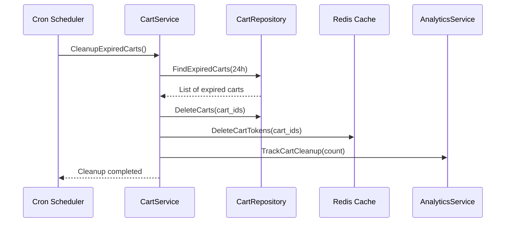
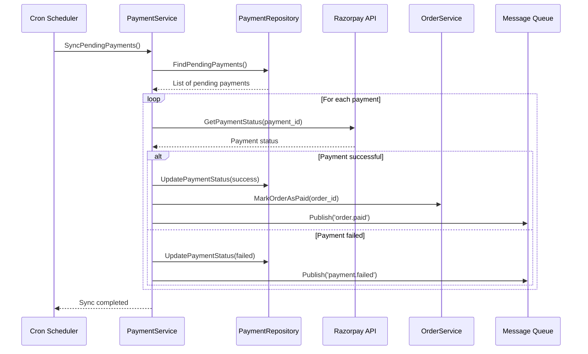
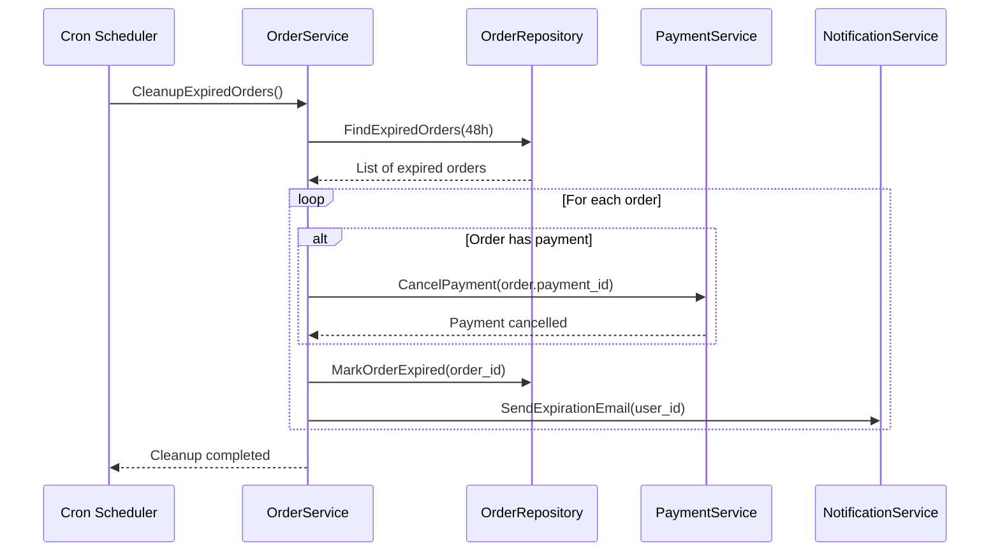
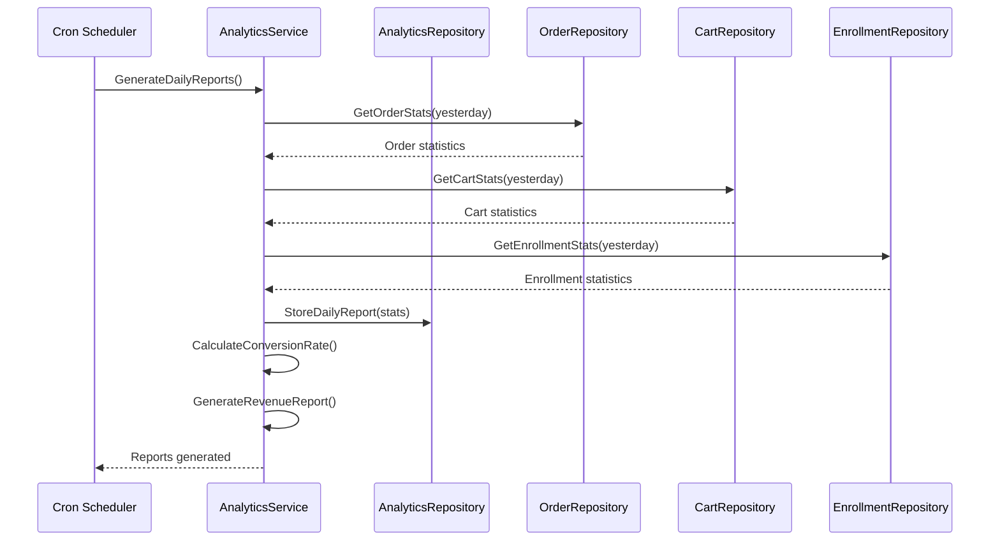

# ⏰ **CRON JOBS & BACKGROUND PROCESSING DIAGRAM**

## 🔄 **Scheduled Tasks & Background Processing Flow**

```mermaid
graph TB
  %% Cron Scheduler
  subgraph "Cron Scheduler"
    CRON["Cron Scheduler"]
    CRON1["Every 15min"]
    CRON2["Every 30min"]
    CRON3["Every hour"]
    CRON4["Daily at 2 AM"]
    CRON5["Weekly on Sunday"]
  end

  %% Cart Management
  subgraph "Cart Management"
    CART_CLEANUP["Cart Cleanup Job"]
    CART_EXPIRED["Delete Expired Carts"]
    CART_ABANDONED["Clean Abandoned Carts"]
    CART_STATS["Update Cart Statistics"]
  end

  %% Payment Processing
  subgraph "Payment Processing"
    PAYMENT_SYNC["Payment Sync Job"]
    PAYMENT_RETRY["Retry Failed Payments"]
    PAYMENT_VERIFY["Verify Payment Status"]
    PAYMENT_REPORT["Generate Payment Reports"]
  end

  %% Order Management
  subgraph "Order Management"
    ORDER_CLEANUP["Order Cleanup Job"]
    ORDER_EXPIRED["Mark Expired Orders"]
    ORDER_ORPHANED["Clean Orphaned Orders"]
    ORDER_SYNC["Sync Order Status"]
  end

  %% Analytics & Reporting
  subgraph "Analytics & Reporting"
    ANALYTICS_DAILY["Daily Analytics Job"]
    ANALYTICS_WEEKLY["Weekly Analytics Job"]
    CONVERSION_REPORT["Conversion Reports"]
    REVENUE_REPORT["Revenue Reports"]
    BUSINESS_INTEL["Business Intelligence"]
  end

  %% Database Maintenance
  subgraph "Database Maintenance"
    DB_BACKUP["Database Backup"]
    DB_OPTIMIZE["Database Optimization"]
    DB_CLEANUP["Database Cleanup"]
    DB_MONITOR["Database Monitoring"]
  end

  %% External Service Health
  subgraph "External Services"
    WEBHOOK_HEALTH["Webhook Health Check"]
    PAYMENT_GATEWAY["Payment Gateway Health"]
    EMAIL_SERVICE["Email Service Health"]
    CACHE_HEALTH["Cache Health Check"]
  end

  %% Cron Triggers
  CRON --> CRON1
  CRON --> CRON2
  CRON --> CRON3
  CRON --> CRON4
  CRON --> CRON5

  %% 15-minute jobs
  CRON1 --> CART_CLEANUP
  CRON1 --> WEBHOOK_HEALTH

  %% 30-minute jobs
  CRON2 --> PAYMENT_SYNC
  CRON2 --> PAYMENT_GATEWAY

  %% Hourly jobs
  CRON3 --> ORDER_CLEANUP
  CRON3 --> EMAIL_SERVICE
  CRON3 --> CACHE_HEALTH

  %% Daily jobs
  CRON4 --> ANALYTICS_DAILY
  CRON4 --> DB_BACKUP
  CRON4 --> DB_OPTIMIZE

  %% Weekly jobs
  CRON5 --> ANALYTICS_WEEKLY
  CRON5 --> DB_CLEANUP

  %% Cart Cleanup Flow
  CART_CLEANUP --> CART_EXPIRED
  CART_CLEANUP --> CART_ABANDONED
  CART_CLEANUP --> CART_STATS

  %% Payment Sync Flow
  PAYMENT_SYNC --> PAYMENT_RETRY
  PAYMENT_SYNC --> PAYMENT_VERIFY
  PAYMENT_SYNC --> PAYMENT_REPORT

  %% Order Cleanup Flow
  ORDER_CLEANUP --> ORDER_EXPIRED
  ORDER_CLEANUP --> ORDER_ORPHANED
  ORDER_CLEANUP --> ORDER_SYNC

  %% Analytics Flow
  ANALYTICS_DAILY --> CONVERSION_REPORT
  ANALYTICS_DAILY --> REVENUE_REPORT
  ANALYTICS_WEEKLY --> BUSINESS_INTEL

  %% Database Flow
  DB_BACKUP --> DB_OPTIMIZE
  DB_OPTIMIZE --> DB_CLEANUP
  DB_CLEANUP --> DB_MONITOR

  %% Styling
  classDef cron fill:#fce4ec,stroke:#880e4f,stroke-width:3px
  classDef cart fill:#e8f5e8,stroke:#2e7d32,stroke-width:2px
  classDef payment fill:#fff3e0,stroke:#f57c00,stroke-width:2px
  classDef order fill:#e3f2fd,stroke:#1976d2,stroke-width:2px
  classDef analytics fill:#f3e5f5,stroke:#7b1fa2,stroke-width:2px
  classDef database fill:#ffebee,stroke:#c62828,stroke-width:2px
  classDef external fill:#e0f2f1,stroke:#00695c,stroke-width:2px

  class CRON,CRON1,CRON2,CRON3,CRON4,CRON5 cron
  class CART_CLEANUP,CART_EXPIRED,CART_ABANDONED,CART_STATS cart
  class PAYMENT_SYNC,PAYMENT_RETRY,PAYMENT_VERIFY,PAYMENT_REPORT payment
  class ORDER_CLEANUP,ORDER_EXPIRED,ORDER_ORPHANED,ORDER_SYNC order
  class ANALYTICS_DAILY,ANALYTICS_WEEKLY,CONVERSION_REPORT,REVENUE_REPORT,BUSINESS_INTEL analytics
  class DB_BACKUP,DB_OPTIMIZE,DB_CLEANUP,DB_MONITOR database
  class WEBHOOK_HEALTH,PAYMENT_GATEWAY,EMAIL_SERVICE,CACHE_HEALTH external
```



## 📋 **Detailed Cron Job Specifications**

### **1. Cart Cleanup Job (Every 15 minutes)**



**Implementation:**

```go
func (cs *CartService) CleanupExpiredCarts() error {
    // Find carts older than 24 hours
    expiredCarts, err := cs.cartRepo.FindExpiredCarts(24 * time.Hour)
    if err != nil {
        return err
    }

    for _, cart := range expiredCarts {
        // Delete from database
        if err := cs.cartRepo.DeleteCart(cart.ID); err != nil {
            log.Printf("Failed to delete cart %s: %v", cart.ID, err)
            continue
        }

        // Delete from cache
        cs.cache.Delete(fmt.Sprintf("cart:%s", cart.Token))

        // Track analytics
        cs.analyticsSvc.TrackEvent("cart_expired", map[string]interface{}{
            "cart_id": cart.ID,
            "internship_id": cart.InternshipID,
            "age_hours": time.Since(cart.CreatedAt).Hours(),
        })
    }

    return nil
}
```

### **2. Payment Sync Job (Every 30 minutes)**



**Implementation:**

```go
func (ps *PaymentService) SyncPendingPayments() error {
    // Find payments pending for more than 1 hour
    pendingPayments, err := ps.paymentRepo.FindPendingPayments(1 * time.Hour)
    if err != nil {
        return err
    }

    for _, payment := range pendingPayments {
        // Check status with payment gateway
        status, err := ps.razorpay.GetPaymentStatus(payment.GatewayPaymentID)
        if err != nil {
            log.Printf("Failed to get payment status for %s: %v", payment.ID, err)
            continue
        }

        // Update payment status
        if err := ps.paymentRepo.UpdatePaymentStatus(payment.ID, status); err != nil {
            log.Printf("Failed to update payment status for %s: %v", payment.ID, err)
            continue
        }

        // Handle successful payments
        if status == "captured" {
            if err := ps.orderService.MarkOrderAsPaid(payment.OrderID); err != nil {
                log.Printf("Failed to mark order as paid: %v", err)
            }

            // Publish event for enrollment
            ps.messageQueue.Publish("order.paid", map[string]interface{}{
                "order_id": payment.OrderID,
                "payment_id": payment.ID,
            })
        }
    }

    return nil
}
```

### **3. Order Cleanup Job (Every hour)**



### **4. Daily Analytics Job (2 AM daily)**



## 🔧 **Background Job Implementation**

### **Job Queue System**

```go
type JobQueue struct {
    redis    *redis.Client
    workers  int
    handlers map[string]JobHandler
}

type JobHandler func(payload []byte) error

type Job struct {
    ID        string                 `json:"id"`
    Type      string                 `json:"type"`
    Payload   map[string]interface{} `json:"payload"`
    Priority  int                    `json:"priority"`
    CreatedAt time.Time             `json:"created_at"`
    Retries   int                    `json:"retries"`
    MaxRetries int                   `json:"max_retries"`
}

func (jq *JobQueue) Enqueue(jobType string, payload map[string]interface{}, priority int) error {
    job := Job{
        ID:        uuid.New().String(),
        Type:      jobType,
        Payload:   payload,
        Priority:  priority,
        CreatedAt: time.Now(),
        Retries:   0,
        MaxRetries: 3,
    }

    jobData, err := json.Marshal(job)
    if err != nil {
        return err
    }

    return jq.redis.LPush(fmt.Sprintf("jobs:%s", jobType), jobData).Err()
}

func (jq *JobQueue) ProcessJobs() {
    for {
        // Process high priority jobs first
        for _, jobType := range []string{"payment_retry", "enrollment_create", "notification_send"} {
            jq.processJobType(jobType)
        }

        // Process regular jobs
        for _, jobType := range []string{"analytics_track", "email_send", "cache_cleanup"} {
            jq.processJobType(jobType)
        }

        time.Sleep(1 * time.Second)
    }
}
```

### **Retry Mechanism with Exponential Backoff**

```go
func (jq *JobQueue) processJobWithRetry(job *Job) error {
    handler, exists := jq.handlers[job.Type]
    if !exists {
        return fmt.Errorf("no handler for job type: %s", job.Type)
    }

    jobData, err := json.Marshal(job.Payload)
    if err != nil {
        return err
    }

    err = handler(jobData)
    if err != nil {
        if job.Retries < job.MaxRetries {
            // Calculate backoff delay
            delay := time.Duration(math.Pow(2, float64(job.Retries))) * time.Second
            if delay > 30*time.Second {
                delay = 30 * time.Second
            }

            // Re-queue with retry
            job.Retries++
            time.Sleep(delay)
            return jq.Enqueue(job.Type, job.Payload, job.Priority)
        }

        // Move to dead letter queue
        return jq.moveToDeadLetter(job)
    }

    return nil
}
```

## 📊 **Monitoring & Alerting**

### **Job Monitoring**

```go
type JobMonitor struct {
    metrics map[string]*JobMetrics
    alerts  AlertService
}

type JobMetrics struct {
    TotalJobs     int64
    SuccessfulJobs int64
    FailedJobs    int64
    AverageTime   time.Duration
    LastRun       time.Time
}

func (jm *JobMonitor) TrackJob(jobType string, duration time.Duration, success bool) {
    metrics := jm.metrics[jobType]
    if metrics == nil {
        metrics = &JobMetrics{}
        jm.metrics[jobType] = metrics
    }

    atomic.AddInt64(&metrics.TotalJobs, 1)
    if success {
        atomic.AddInt64(&metrics.SuccessfulJobs, 1)
    } else {
        atomic.AddInt64(&metrics.FailedJobs, 1)
    }

    // Update average time
    metrics.AverageTime = time.Duration(
        (int64(metrics.AverageTime) + int64(duration)) / 2,
    )
    metrics.LastRun = time.Now()

    // Check for alerts
    if metrics.FailedJobs > 10 {
        jm.alerts.SendAlert(fmt.Sprintf("Job %s has high failure rate", jobType))
    }
}
```

### **Health Check Endpoints**

```go
func (s *Server) healthCheckHandler(w http.ResponseWriter, r *http.Request) {
    health := map[string]interface{}{
        "status": "healthy",
        "timestamp": time.Now(),
        "services": map[string]interface{}{
            "database": s.checkDatabaseHealth(),
            "redis": s.checkRedisHealth(),
            "payment_gateway": s.checkPaymentGatewayHealth(),
            "email_service": s.checkEmailServiceHealth(),
        },
        "cron_jobs": s.getCronJobStatus(),
        "background_jobs": s.getBackgroundJobStatus(),
    }

    w.Header().Set("Content-Type", "application/json")
    json.NewEncoder(w).Encode(health)
}
```

This comprehensive cron job and background processing system ensures the checkout flow remains robust, with proper cleanup, monitoring, and error recovery mechanisms in place.
