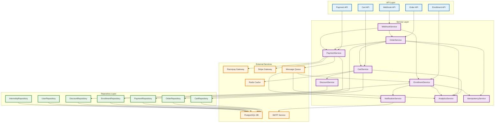
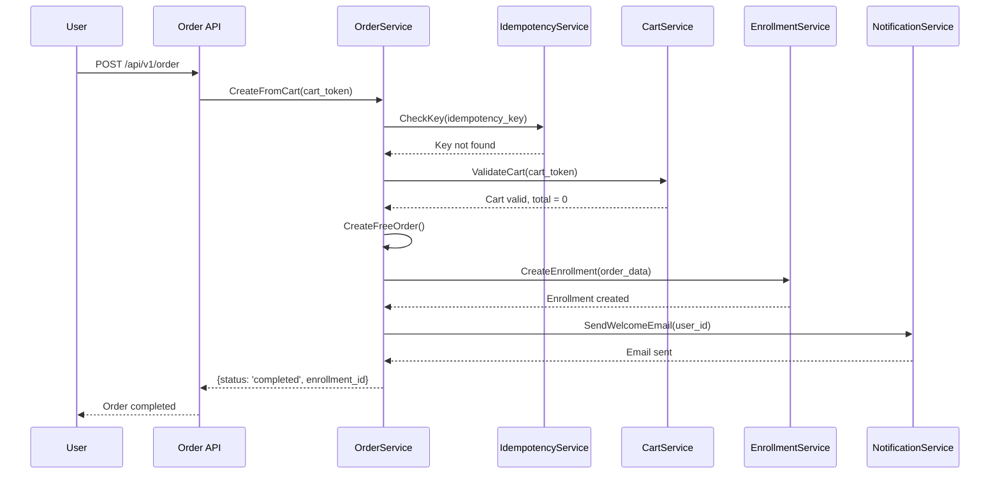
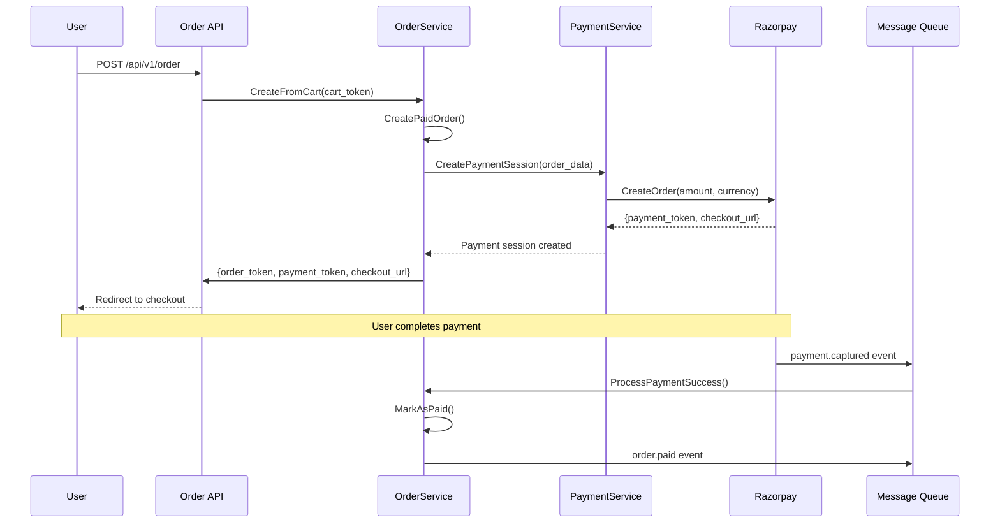
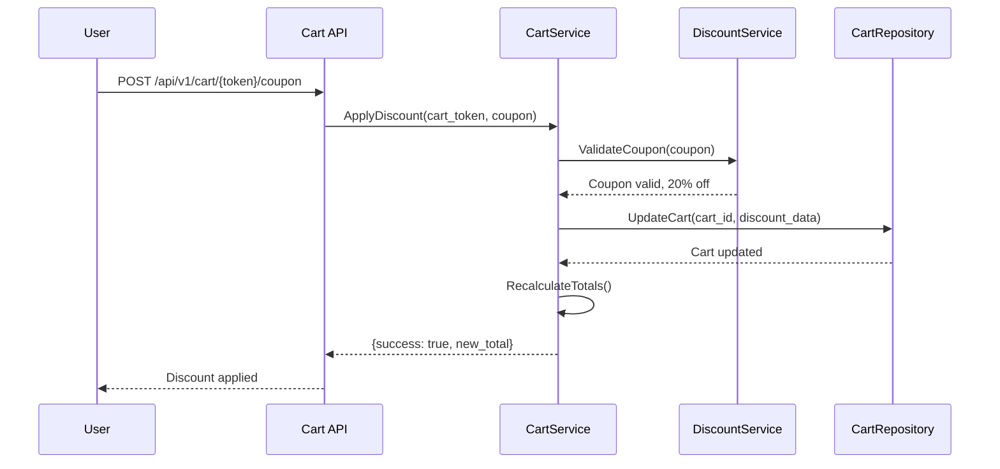
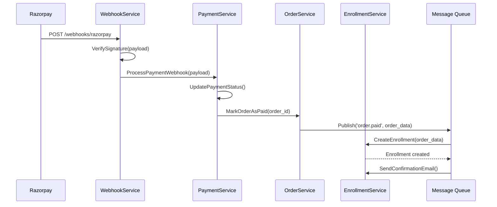

# 🏗️ **SERVICE ARCHITECTURE & INTERACTIONS DIAGRAM**

## 🔄 **Service Layer Interactions & Data Flow**



## 🎯 **Scenario-Based Service Interactions**

### **1. Free Internship Flow**



### **2. Paid Internship Flow**



### **3. Discount Application Flow**



### **4. Webhook Processing Flow**



## 🔧 **Service Implementation Details**

### **CartService Implementation**

```go
type CartService struct {
    cartRepo    CartRepository
    cache       CacheProvider
    discountSvc DiscountService
    analyticsSvc AnalyticsService
}

func (cs *CartService) CreateCart(req CreateCartRequest) (*Cart, error) {
    // 1. Validate internship exists and is active
    // 2. Generate unique cart token
    // 3. Calculate initial pricing
    // 4. Store in Redis (TTL: 24h)
    // 5. Store in PostgreSQL
    // 6. Track analytics event
}

func (cs *CartService) ApplyDiscount(cartToken, coupon string) error {
    // 1. Validate cart exists and not expired
    // 2. Validate coupon with DiscountService
    // 3. Apply discount calculation
    // 4. Update cart in cache and DB
    // 5. Recalculate totals
}
```

### **OrderService Implementation**

```go
type OrderService struct {
    orderRepo      OrderRepository
    cartSvc        CartService
    paymentSvc     PaymentService
    idempotencySvc IdempotencyService
    analyticsSvc   AnalyticsService
}

func (os *OrderService) CreateFromCart(cartToken, idempotencyKey string) (*Order, error) {
    // 1. Check idempotency key
    // 2. Validate cart and get final pricing
    // 3. Determine if payment required
    // 4. Create order record
    // 5. Handle free vs paid flow
    // 6. Store idempotency response
}

func (os *OrderService) CreateFreeOrder(cartData *Cart) (*Order, error) {
    // 1. Create order with status 'completed'
    // 2. Create enrollment immediately
    // 3. Send welcome notification
    // 4. Track conversion
}
```

### **PaymentService Implementation**

```go
type PaymentService struct {
    paymentRepo PaymentRepository
    razorpay    RazorpayProvider
    stripe      StripeProvider
    messageQueue MessageQueue
}

func (ps *PaymentService) CreatePaymentSession(order *Order) (*PaymentSession, error) {
    // 1. Determine payment gateway based on amount/currency
    // 2. Create payment intent with gateway
    // 3. Store payment session
    // 4. Return checkout URL
}

func (ps *PaymentService) ProcessWebhook(payload []byte, signature string) error {
    // 1. Verify webhook signature
    // 2. Parse payment status
    // 3. Update payment record
    // 4. Trigger order status update
    // 5. Publish event for enrollment
}
```

## 🛡️ **Error Handling & Resilience**

### **Circuit Breaker Implementation**

```go
type CircuitBreaker struct {
    failureThreshold int
    recoveryTimeout  time.Duration
    state           CircuitState
    failureCount    int
    lastFailureTime time.Time
}

func (cb *CircuitBreaker) Execute(command func() error) error {
    if cb.state == Open {
        if time.Since(cb.lastFailureTime) > cb.recoveryTimeout {
            cb.state = HalfOpen
        } else {
            return ErrCircuitBreakerOpen
        }
    }

    err := command()
    if err != nil {
        cb.recordFailure()
        return err
    }

    cb.recordSuccess()
    return nil
}
```

### **Retry Mechanism**

```go
type RetryConfig struct {
    MaxAttempts     int
    InitialDelay    time.Duration
    MaxDelay        time.Duration
    BackoffFactor   float64
    RetryableErrors []int
}

func (rc *RetryConfig) Execute(command func() error) error {
    var lastErr error
    delay := rc.InitialDelay

    for attempt := 1; attempt <= rc.MaxAttempts; attempt++ {
        err := command()
        if err == nil {
            return nil
        }

        lastErr = err
        if !rc.isRetryable(err) {
            return err
        }

        if attempt < rc.MaxAttempts {
            time.Sleep(delay)
            delay = time.Duration(float64(delay) * rc.BackoffFactor)
            if delay > rc.MaxDelay {
                delay = rc.MaxDelay
            }
        }
    }

    return lastErr
}
```

## 📊 **Data Models & Relationships**

### **Cart Entity**

```go
type Cart struct {
    ID              string    `json:"id"`
    Token           string    `json:"token"`
    UserID          *string   `json:"user_id,omitempty"`
    InternshipID    string    `json:"internship_id"`
    Period          Period    `json:"period"`
    Subtotal        int64     `json:"subtotal"`
    Total           int64     `json:"total"`
    TaxAmount       int64     `json:"tax_amount"`
    DiscountAmount  int64     `json:"discount_amount"`
    CouponCode      *string   `json:"coupon_code,omitempty"`
    Status          string    `json:"status"`
    ExpiresAt       time.Time `json:"expires_at"`
    CreatedAt       time.Time `json:"created_at"`
    UpdatedAt       time.Time `json:"updated_at"`
}
```

### **Order Entity**

```go
type Order struct {
    ID              string    `json:"id"`
    Token           string    `json:"token"`
    CartID          string    `json:"cart_id"`
    UserID          string    `json:"user_id"`
    InternshipID    string    `json:"internship_id"`
    Status          string    `json:"status"`
    Subtotal        int64     `json:"subtotal"`
    Total           int64     `json:"total"`
    TaxAmount       int64     `json:"tax_amount"`
    DiscountAmount  int64     `json:"discount_amount"`
    PaymentToken    *string   `json:"payment_token,omitempty"`
    EnrollmentID    *string   `json:"enrollment_id,omitempty"`
    CreatedAt       time.Time `json:"created_at"`
    UpdatedAt       time.Time `json:"updated_at"`
}
```

This architecture ensures clean separation of concerns, robust error handling, and scalable service interactions while maintaining data consistency and system reliability.
