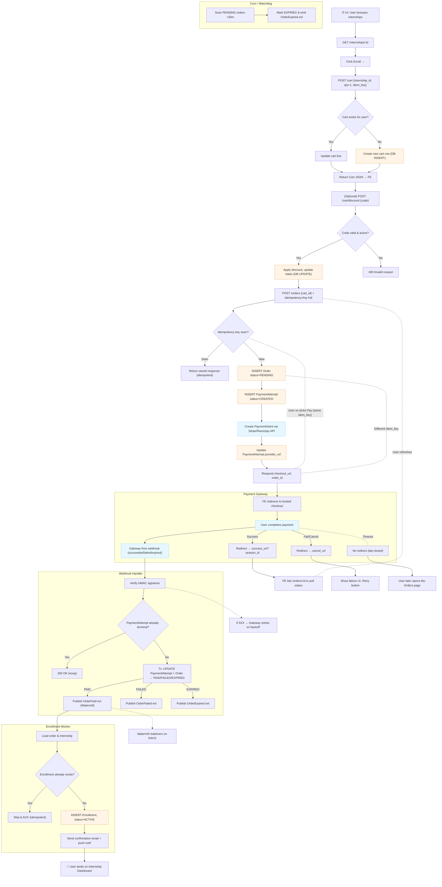

```mermaid
flowchart TD
%% SECTION 1 – Product Discovery & Cart
U1["🖱️ UI: User browses internships"] --> U2["GET /internships/:id"]
U2 --> U3["Click Enroll →"]
U3 --> C1["POST /cart {internship_id, qty=1, idem_key}"]
C1 --> C2{Cart exists for user?}
C2 -- "Yes" --> C3["Update cart line"]
C2 -- "No" --> C4["Create new cart row (DB INSERT)"]
C3 & C4 --> C5["Return Cart JSON → FE"]

%% Discount
C5 --> D1["(Optional) POST /cart/discount {code}"]
D1 --> D2{Code valid & active?}
D2 -- "Yes" --> D3["Apply discount, update totals (DB UPDATE)"]
D2 -- "No" --> D4["400 Invalid coupon"]

%% SECTION 2 – Order & Payment Session
D3 --> O1["POST /orders {cart_id} + Idempotency-Key hdr"]
O1 --> O2{idempotency key seen?}
O2 -- "Seen" --> O3["Return stored response (idempotent)"]
O2 -- "New" --> O4["INSERT Order status=PENDING"]
O4 --> O5["INSERT PaymentAttempt status=CREATED"]
O5 --> PG1["Create PaymentIntent via Stripe/Razorpay API"]
PG1 --> O6["Update PaymentAttempt.provider_ref"]
O6 --> FE1["Respond checkout_url, order_id"]
FE1 --> FE2["FE redirects to hosted checkout"]

%% SECTION 3 – Gateway Journey
subgraph "Payment Gateway"
FE2 --> PG2["User completes payment"]
PG2 -- "Success" --> PG3["Redirect → success_url?session_id"]
PG2 -- "Fail/Cancel" --> PG4["Redirect → cancel_url"]
PG2 -. "Timeout" .- PG5["No redirect (tab closed)"]
PG2 --> WH0["Gateway fires webhook (succeeded/failed/expired)"]
end

%% SECTION 4 – Synchronous UX after redirect
PG3 --> UX1["FE hits /orders/:id to poll status"]
PG4 --> UX2["Show failure UI, Retry button"]
PG5 --> UX3["User later opens My-Orders page"]

%% SECTION 5 – Webhook Handler (Gin)
subgraph "Webhook Handler"
WH0 --> WH1["Verify HMAC signature"]
WH1 --> WH2{PaymentAttempt already terminal?}
WH2 -- "Yes" --> WH3["200 OK (noop)"]
WH2 -- "No" --> WH4["Tx: UPDATE PaymentAttempt + Order → PAID/FAILED/EXPIRED"]
WH4 -- "PAID" --> EVT1["Publish OrderPaid evt (Watermill)"]
WH4 -- "FAILED" --> EVT2["Publish OrderFailed evt"]
WH4 -- "EXPIRED" --> EVT3["Publish OrderExpired evt"]
end

%% SECTION 6 – Event Driven Enrollment
subgraph "Enrollment Worker"
EVT1 --> EN1["Load order & internship"]
EN1 --> EN2{Enrollment already exists?}
EN2 -- "Yes" --> EN3["Skip & ACK (idempotent)"]
EN2 -- "No" --> EN4["INSERT Enrollment, status=ACTIVE"]
EN4 --> EN5["Send confirmation email + push notif"]
end

%% SECTION 7 – Retry & Timeouts
WH1 -.-> WR1["If 5XX → Gateway retries w/ backoff"]
EVT1 -.-> DLQ1["Watermill redelivers on NACK"]
subgraph "Cron / Watchdog"
CR1["Scan PENDING orders >30m"] --> CR2["Mark EXPIRED & emit OrderExpired evt"]
end

%% SECTION 8 – Duplicate Calls / Page Refresh
UX1 -. "User refreshes" .- O1
FE1 -. "User re-clicks Pay (same idem_key)" .- O2
FE1 -. "Different idem_key" .- O4

%% END STATE
EN5 --> UDone["🎉 User lands on Internship Dashboard"]

%% Styling
classDef db fill:#fff4e6,stroke:#e0af69,stroke-width:1px
class C4,D3,O4,O5,O6,EN4 db
classDef ext fill:#e6f7ff,stroke:#8cc8ff
class PG1,PG2,WH0 ext
```
